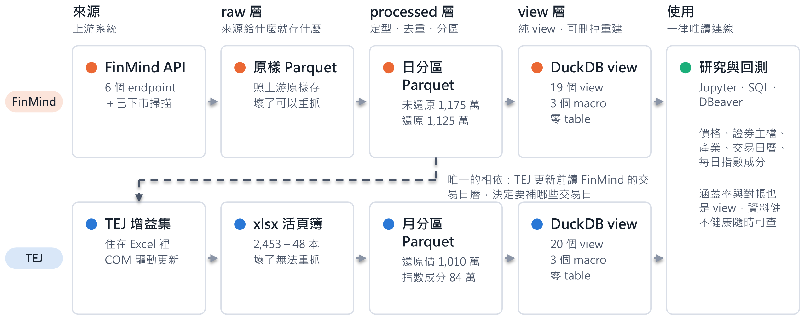
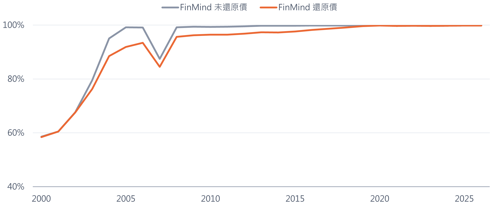
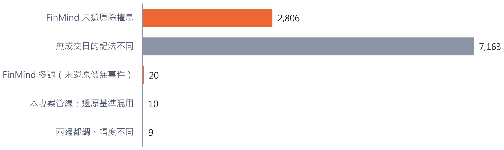
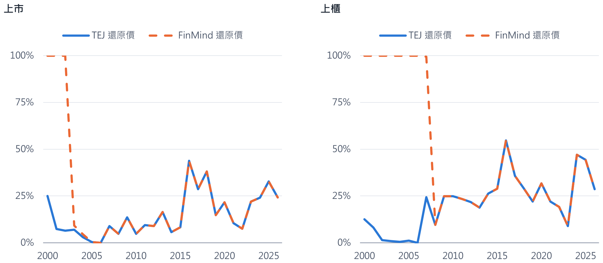
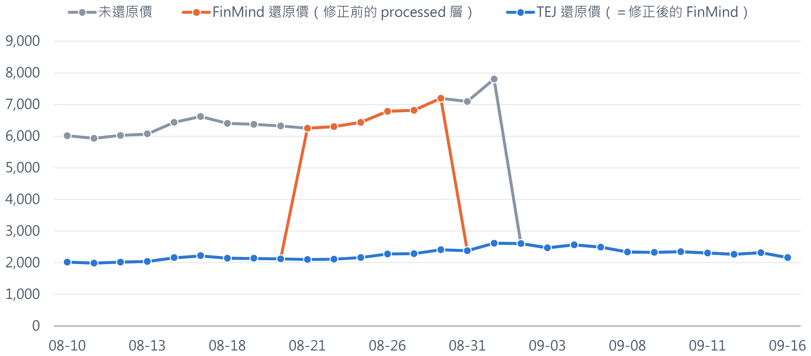
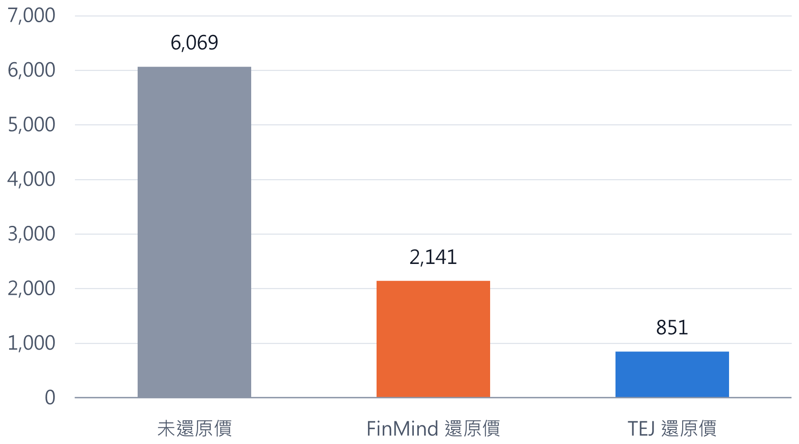

# financial-db — 台股研究級資料倉儲

> 從資料蒐集、分層建模到跨來源驗證。研究所備審資料（財務工程／資料科學）專題，2026 年 8–10 月。

兩條獨立的台股日資料管線——**FinMind API** 與 **TEJ Smart Wizard**（Excel 增益集，沒有 API）——
遵守同一套三層契約：`raw` 保留上游原貌、`processed` 是定型／去重／分區的 Parquet、
DuckDB 只存 view，可隨時刪除重建。有了兩個來源之後，再用第二個來源驗證第一個：
868 萬筆日報酬中 99.96% 相差在 10 bp 以內，其餘 10,008 個不一致日每一筆都歸因到具體原因，
過程中也抓到並修正了自己管線裡的一個去重錯誤。

## English abstract

A research-grade daily data warehouse for Taiwan equities, built from two independent sources:
the FinMind REST API (whole market, 1994–) and TEJ Smart Wizard (an Excel add-in with no API,
driven through COM automation; TWN50 / TM100 historical constituents and 2,453 securities with
survivorship-bias-free adjusted prices). Both pipelines follow one three-layer contract:
*raw* is stored untouched, *processed* is typed, de-duplicated, partitioned Parquet, and DuckDB
holds only views (39 in total) so the database file can be deleted and rebuilt at any time.
Correctness rests on 286 automated tests, 63 read-only health checks, and cross-validation
between the two sources on daily *returns* rather than price levels: 99.96% of 8.68 M
overlapping daily returns agree within 10 bp, and every one of the remaining 10,008
disagreeing days is attributed to a cause (unadjusted corporate actions in FinMind before
2003/2008, zero-coded no-trade days, a dedupe bug in this project's own pipeline that the
comparison exposed and that has since been fixed with regression tests).

| | |
|---|---|
| Rows | **33.9 M** (FinMind 11.75 M unadjusted + 11.25 M adjusted; TEJ 10.1 M adjusted + 0.84 M index membership) |
| Coverage | FinMind: ~3,900 securities incl. 767 recovered delisted ones, 1994-10 →; TEJ: 2,453 securities (462 no longer trading, full history kept), 2000-09 → |
| Views / macros | 39 views + 6 macros, zero tables; each `.duckdb` file is 268 KB |
| Tests / checks | 286 pytest cases, 63 read-only health checks run after every scheduled job |
| Cross-validation | 2,188 common securities, 9.4 M overlapping rows; 99.96 % of clean daily returns agree within 10 bp |
| Stack | Python 3.12 · DuckDB · PyArrow / Parquet · pandas · requests · pywin32 (Excel COM) · pytest · Windows Task Scheduler |



## 先看哪裡

| 想知道 | 看這裡 |
|---|---|
| 完整專案說明（23 頁） | [`docs/financial-db-專案說明書.pdf`](docs/financial-db-專案說明書.pdf) |
| 簡報版（29 頁） | [`docs/financial-db-專案簡報.pdf`](docs/financial-db-專案簡報.pdf) |
| 兩個來源哪裡不同、誰比較可信（資料科學部分） | 本文〈[跨來源驗證](#跨來源驗證finmind-與-tej-哪裡不同誰是對的)〉→ [`analysis/README.md`](analysis/README.md) → 程式 [`02_source_comparison.py`](analysis/scripts/02_source_comparison.py) |
| **互動式資料地圖**（資料流、兩庫對照、排程時間軸、建置指令） | [線上版](https://brianwen818.github.io/financial-db-public/docs/data-map.html)（[claude.ai 版](https://claude.ai/artifact/GqF3hpkMRJ9nmH1Rrkae64)）・[Markdown 版](docs/data-map.md) |
| **互動式 Schema 圖**（raw／processed／view 三層血緣，滑鼠移到表上亮起上下游） | [線上版](https://brianwen818.github.io/financial-db-public/docs/schema-map.html)（[claude.ai 版](https://claude.ai/artifact/XpiSgGeqyfSWwNq79Y4BVT)）・[Markdown 版](docs/schema-map.md) |
| 資料庫怎麼選、view 與陷阱 | [`pipelines/README.md`](pipelines/README.md) |
| 管線程式碼 | [`pipelines/finmind/src/finmind_pipeline/`](pipelines/finmind/src/finmind_pipeline/)、[`pipelines/tej-wizard/src/tej_pipeline/`](pipelines/tej-wizard/src/tej_pipeline/) |
| SQL view 與 macro | [`pipelines/finmind/sql/`](pipelines/finmind/sql/)、[`pipelines/tej-wizard/sql/`](pipelines/tej-wizard/sql/) |
| 測試 | [`pipelines/finmind/tests/`](pipelines/finmind/tests/)（210）、[`pipelines/tej-wizard/tests/`](pipelines/tej-wizard/tests/)（76） |
| 設計取捨與上游缺陷的處理 | [`pipelines/finmind/docs/`](pipelines/finmind/docs/)、[`pipelines/tej-wizard/docs/`](pipelines/tej-wizard/docs/) |
| 只會 pandas 的使用教學 | [`pipelines/finmind/notebooks/database_usage_guide.ipynb`](pipelines/finmind/notebooks/database_usage_guide.ipynb) |

## 技術重點

**1. 三層契約，view-only DuckDB。** raw 一個字不改（FinMind 的欄名還是上游的 `max`、`min`、
`Trading_Volume`；TEJ 的 xlsx 原檔即唯一真相）。processed 才是查詢契約：定型、依自然鍵去重、
按 `year/month` 分區。DuckDB 檔只有 268 KB，因為它一張表都沒有，刪掉重跑 `build_db.py` 就回來。
日期範圍查詢走 macro 才會裁剪分區（實測 0.56 s → 0.13 s）。

**2. 存活者偏誤是量化過的，不是口頭提醒。** FinMind 的證券主檔只列現存證券；管線自 2004 年起
每月抽一天全市場掃描，找回 767 檔已下市證券。結果寫進 `v_securities_all`，README 明示
「無偏誤橫斷面最早到 2004-02-11」與「還原價只涵蓋 7/767 已下市檔，survivors-only」。
TEJ 一側則保留 462 檔已停止交易證券的完整還原歷史。

**3. 沒有 API 的來源也能自動化。** TEJ 資料只能透過 Excel 增益集取得。
[`excel_refresh.py`](pipelines/tej-wizard/src/tej_pipeline/ingestion/excel_refresh.py) 以 COM 驅動
隱藏的 Excel 跑在獨立的 Windows desktop 上（不搶焦點），先依 FinMind 的交易日曆往工作表插入缺漏
交易日、再同步等增益集填完，watchdog 逾時就砍掉；新增日期沒填出收盤價就不存檔、整次更新停止。

**4. 跨行程限流、原子寫入、可重跑排程。** API 配額用跨行程 token bucket 管理
（[`rate_limiter.py`](pipelines/finmind/src/finmind_pipeline/utils/rate_limiter.py)）；Parquet 一律
寫暫存目錄再換名（[`parquet_io.py`](pipelines/finmind/src/finmind_pipeline/utils/parquet_io.py)）；
每日更新是「新日期 ∪ 最近 3 天重抓 ∪ 範圍內缺漏」的聯集，漏跑不必手動補；每次執行寫 JSONL，
以 `v_ingestion_runs` 查詢。

**5. 資料正確性是可以重跑的檢查，不是口頭保證。** 286 個自動化測試（FinMind 210、TEJ 76）、
63 項唯讀健康檢查（28＋35）在排程結束後自動執行；每週對帳四類問題（缺漏日、稀薄日、沒有資料的證券、
停更的證券）；**0 次手改資料**——資料只由程式產生，要改資料就改程式再重跑。上游缺陷每一項都有對應的
處理與測試：日期欄是字串 `"None"`（32 列）、1999 年以前有週六盤（176 天）、官方日曆列了實際休市日
（2026-07-10）、收盤後成交量被修正（0050：39,946,000 → 43,382,378）、產業名稱飄移（創新板／創新版）。

**6. 用第二個來源驗證第一個，連自己的錯誤一起抓出來。** 這是本專案的資料科學部分，見下一節。

## 跨來源驗證：FinMind 與 TEJ 哪裡不同、誰是對的

有了兩個獨立來源，就能回答單一來源答不了的問題。本節所有數字都由
[`analysis/scripts/02_source_comparison.py`](analysis/scripts/02_source_comparison.py) 產生、可重跑，
對應專案說明書第 7–8 章；更完整的表格在 [`analysis/README.md`](analysis/README.md)。

### 先量化存活者偏誤

回測只用現存公司，報酬會被高估。先看兩個來源各自保留了多少已下市公司：

| | |
|---|---|
| **7 / 767** | FinMind 找回的已下市證券中，有還原價的檔數（未還原價有 466 檔）。還原價 **survivors-only**，任何用它的結論都必須標註 |
| **462** | TEJ 已停止交易、仍保有完整還原歷史的檔數；FinMind 還原價只涵蓋其中 197 檔 |
| **2004-02-11** | FinMind 能做無偏誤橫斷面的最早日期（全市場端點的資料起點）；更早只有現存公司 |



### 驗證方法：比報酬，不比價格水準

1. **為什麼不比水準。** 兩邊都把歷史回溯到最新基準，只要重抓日期不同，整段價格水準就差一個常數。
   逐列比還原收盤價只有 69.3 % 相差在 0.01 元以內——但那不代表有錯。
2. **改比日報酬。** 同一檔、同一天的報酬不受基準影響。再拿 FinMind **未還原**報酬當第三把尺：
   某天誰的報酬等於未還原報酬，誰那天就沒有做調整——這把「誰對誰錯」變成可以逐筆判定的規則。
3. **用交易制度當檢驗。** 台股有漲跌幅限制（2015-06 前 7 %、之後 10 %）。還原後仍超過限制的報酬，
   不是真實事件，就是沒有調乾淨。這是不需要第三個來源的合理性檢驗。

| 2,188 檔 | 941 萬列 | 868 萬筆 | 99.96 % | 10,008 |
|:---:|:---:|:---:|:---:|:---:|
| 兩邊共有的證券 | 交集列數（2000-09 → 2026-09） | 上市櫃、前後兩天都有成交的乾淨日報酬 | 日報酬相差在 10 bp 以內（相關係數 0.9963） | 相差超過 1 % 的交易日，**全部逐筆歸因** |

### 10,008 個不一致的交易日，每一筆都找到原因

| 原因 | 交易日 | 證券 | 判定方式 |
|---|---:|---:|---|
| 無成交日的記法不同 | 7,163 | 401 | FinMind 未還原收盤價為 0 的日子及其次日；TEJ 記參考價，其中 1,614 天正好落在漲跌停價 |
| FinMind 未還原除權息 | 2,806 | 864 | FinMind 報酬＝未還原報酬、TEJ ≠；幾乎都在 2007 年以前 |
| FinMind 多調 | 20 | 20 | 未還原價沒有事件，還原價卻跳動（例：6949 在 2024-03-11 為 −95 %） |
| **本專案管線**：還原基準混用 | 10 | 10 | 修正前 105 天 → 修正後 10 天，都落在最近一次每週重抓之後 |
| 兩邊都調、幅度不同 | 9 | 9 | 尚待逐筆查證 |



### 發現一：FinMind 的還原價，早期其實沒有還原

逐年統計「未還原價超過漲跌幅」的跳空（大致就是除權息日），再看還原後還剩多少。
**上市股到 2002 年、上櫃股到 2007 年，FinMind 的還原價留著全部的除權息跳空**（殘留比例 100 %）；
之後兩條線重合。共 2,806 個交易日、864 檔——拿這段期間的 FinMind 還原價回測，除權息會被當成單日暴跌。



### 發現二：交叉驗證抓到自己管線的錯誤

6669 緯穎在 2026-09-02 除權。修正前，本專案 processed 層的還原價在前一週出現 **+195 % 與 −67 %** 的假報酬，
而 FinMind 自己的單檔歷史與 TEJ 是一致的——問題在我的去重規則。

- **原因**：同一個 `(stock_id, date)` 可能同時來自「單檔全歷史」與「全市場日檔」，原本一律讓日檔優先
  （收盤後結算快照）。對未還原價這是對的；對還原價是錯的——日檔只是抓取當下那個基準的快照，
  每週重抓的正確全歷史反而被舊快照蓋回去，所以每週重抓也修不好。
- **修正**：還原價改為單檔全歷史優先、日檔只補缺；去重優先序改為每個 dataset 各自設定；新增 4 個測試
  與 1 條健康檢查（來自日檔的交易日數 > 7 就警告）；從 raw 重建、不需呼叫 API。
  紀錄：[changelog](pipelines/finmind/docs/changelog/2026-10-04-adj-dedupe-ticker-first.md)，
  修正前的全部分析結果保留在 [`analysis/outputs/tables_before_fix/`](analysis/outputs/tables_before_fix/)。

| 指標 | 修正前 | 修正後 |
|---|---:|---:|
| 受舊基準污染的資料 | 319 檔、1,046 列 | 0 |
| 混合基準的交易日數 | 19 | 6 |
| 來自本專案管線的不一致交易日 | 105 | 10 |



### 發現三：只有對照第二個來源才看得到的缺陷

| 現象（FinMind 一側） | 規模（實測） | 影響 |
|---|---|---|
| 無成交日的收盤價記成 0 | 未還原價 387,319 列（3.3 %），其中 36,489 列仍有成交量 | 直接算報酬得到 −100 %；查詢時要排除 |
| 成交量單位不一致 | 2000–2003 年有 15–27 % 的列，成交量恰為 TEJ 的千分之一 | 早期成交量不能直接跨年比較 |
| 上櫃資料缺漏 | 2007 年 1–4 月，上櫃股幾乎整段沒有資料 | 該期間的橫斷面不完整 |
| 減資後復牌未調整 | 818 個停牌後跳空 > 25 % 的事件：TEJ 消除 662 個、FinMind 405 個 | FinMind 有 413 個完全沒有調整 |
| 多餘的調整 | 20 個交易日未還原價沒有事件、還原價卻跳動 | 上游錯誤，已列出清單 |

### 誰比較可信：用漲跌幅限制檢驗還原後的報酬

同一批 867 萬筆日報酬中，未還原價有 6,069 筆超過當時的漲跌幅限制；還原之後 **TEJ 剩 851 筆、FinMind 剩 2,141 筆**，
剩下的多是真實事件（例如新掛牌前五日沒有漲跌幅限制）。2008 年以後兩者幾乎相同：2,074 檔中有 1,935 檔整段累積報酬
相差不到 1 %；全期間的差距來自早期：2,101 檔中有 775 檔累積報酬相差超過 10 %，來源就是 2008 年前沒有還原的除權息。



**結論**：算報酬、做回測用 TEJ 還原價；要全市場廣度、真實成交價與 2000 年以前的歷史，用 FinMind 的未還原價。
這個結論不代表 TEJ 每一筆都正確——TEJ 一側仍有待查之處，列在下面。

### 兩個來源各自不能直接相信的地方

| 來源 | 不可信之處 |
|---|---|
| FinMind 還原價 | 上市股 2003 年前、上櫃股 2008 年前沒有還原；減資復牌多數未調整；已下市公司幾乎沒有還原價 |
| FinMind 未還原價 | 無成交日記成 0；2000–2003 年成交量單位不一致；2007 年初上櫃缺漏；2004-02-11 前只有現存公司 |
| FinMind 維度 | 官方交易日曆含實際休市日；每次重爬都改日期戳記；產業分類沒有歷史版本；下市公告只涵蓋約 1/3 的已下市證券 |
| TEJ 還原價 | 同一列混有兩種尺度（只有開高低收是還原價）；18 個交易日的還原報酬超過漲跌幅而未還原價與 FinMind 都沒有，原因待查；內建報酬率欄位與自算報酬有 2,788 列相差 > 1 % |
| TEJ 涵蓋 | 67,707 筆存續期內的缺漏日尚未逐檔查證；2000-09-04 前下市的公司不在內；興櫃期間是議價、約 27 % 的列沒有成交量；raw 無法重製 |

| 需求 | 建議用 | 要注意 |
|---|---|---|
| 長期報酬、技術指標、回測 | TEJ 還原價 | 只有開高低收是還原價；橫斷面以當日有報價者為準 |
| 指數策略 | TEJ 指數成分＋TEJ 還原價 | 用 `index_members_on()` 取當日成分，不要把曾入選的股票放進每一天 |
| 全市場選股池、2000 年以前 | FinMind 未還原價＋`v_securities_all` | 需自行處理除權息；排除收盤價為 0 的列；無偏誤起點 2004-02-11 |
| 真實成交價、成交量 | FinMind 未還原價 | 2004 年以前的成交量單位不一致 |
| FinMind 還原價 | 僅 2008 年以後、現存公司 | 結論必須註明存活者偏誤 |

## Repo 結構

```
financial-db-public/
├── README.md                 本文
├── docs/                     專案說明書、簡報（PDF + 原檔）、互動式資料地圖與 Schema 圖（.html，GitHub Pages 可直接開）及其 Markdown 版
├── pipelines/
│   ├── README.md             兩個資料庫的選用指南、處理步驟、view 清單、陷阱、指令
│   ├── finmind/              FinMind API → Parquet → DuckDB   (src / sql / scripts / tests / docs / notebooks)
│   └── tej-wizard/           TEJ 增益集 → xlsx → Parquet → DuckDB（同上）
└── analysis/
    ├── README.md             跨來源驗證的方法與發現
    ├── scripts/              01_db_snapshot.py、02_source_comparison.py（唯讀查詢兩個 DuckDB）
    ├── build/                由分析結果產生圖表、簡報與說明書的程式（python-pptx / python-docx）
    └── outputs/              figures/ 13 張圖、tables/ 彙總 CSV、tables_before_fix/ 修正前對照
```

## 資料未隨附

本 repo 只有程式碼、文件與彙總結果，**不含任何資料檔**（`db/` 約 6 GB）：

- **TEJ** 是授權資料，不能再散布。
- **FinMind** 可自行到 [finmindtrade.com](https://finmindtrade.com/) 申請 token 後重建，
  步驟見 [`pipelines/README.md`](pipelines/README.md#指令)；資料根目錄預設為 `<repo>/db/`，
  可用 `FINMIND_DB_ROOT`／`TEJ_DB_ROOT` 環境變數覆寫。
- `analysis/outputs/tables/` 只放彙總統計（逐年計數、原因分類、Top-N 摘要），不含逐日價格序列。
- 測試：純單元測試不需要資料，在乾淨環境實測 finmind 166 項、tej-wizard 61 項通過；其餘是對真實資料庫的
  整合測試與 golden-value 測試，需要 token 與已建好的倉儲才能跑。

文件中的 `<repo>` 代表本 repo 的根目錄；原始環境的絕對路徑已全部改寫。

## 已知限制

- FinMind token 自 2026-09-19 起降為免費方案，FinMind 一側資料停在 2026-09-16。
- TEJ 每日排程尚未註冊，指數成分以外的證券僅靠每週全量更新。
- TEJ 一側仍有 18 個超過漲跌幅的還原報酬、2,788 列內建報酬欄位差異與 67,707 個存續期內缺漏日未逐筆查證。
- 只有日頻價量與指數成分，沒有財報、法人與融資券資料。

## 關於

作者：[brianwen818](https://github.com/brianwen818)。本專案為畢業專題的一部分，2026-08-25 起開發；
程式碼與文件由作者撰寫，開發過程中使用 AI 輔助工具（Claude Code）協助。
程式碼以 [MIT License](LICENSE) 釋出；資料來源各依其授權條款，不在授權範圍內。
