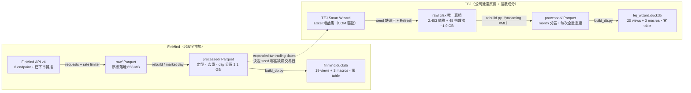
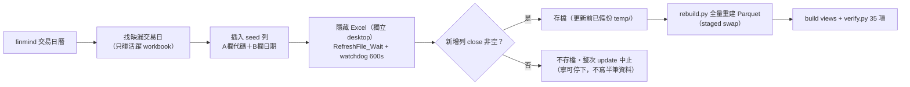

# financial-db 資料地圖

> 兩條台股資料管線的完整架構：來源取得 → raw → processed（Parquet）→ DuckDB view → 更新排程。
> 整理自程式碼與資料庫實測（**2026-09-29**），數字以實測為準；本文為
> 與 [`../pipelines/README.md`](../pipelines/README.md) 互補的總覽；本文數字為 2026-09-29 快照。
> 數字會隨每日更新變動，需要精確值請查 `v_daily_coverage`／`v_ingestion_runs`。

---

## 當前狀態（2026-09-29 實測，過期請忽略）

> **🔴 FinMind 管線自 2026-09-19 起故障中。** FinMind token 已從 Sponsor 降為 **Free tier**，
> 每次 API 呼叫回 `HTTP 400: Your level is register`。09-19 之後每日／每週排程全數失敗，
> **價格資料停在 2026-09-16**。另外 rate limiter 仍按 6,000/hr 配置（Free 上限 600/hr），
> 若維持 Free 需將 `FINMIND_API_HOUR_LIMIT` 改為 600。失敗紀錄查 `v_ingestion_runs`。

> **🟠 TEJ 於 2026-09-28 完成大擴充。**
> ① universe 從「指數成分 365 檔」擴為**全公司池 2,453 檔／10,093,712 列**
> （TSE／OTC／創新板曾上市、2000-09-04 後未下市的公司 + 0050/0051）。
> ② **每日排程「TEJ daily update」至今未註冊**，目前只有每週日全量在自動跑；
> 全量重抓從約 2 小時變為**約 8 小時**（2,453 本 workbook）。

---

## 總覽：資料怎麼流

兩條管線互相獨立、契約相同：**raw**（來源給什麼存什麼，一字不改）→
**processed**（定型、去重、Hive 分區的 Parquet，這才是查詢契約）→
**DuckDB**（純 view 層蓋在 Parquet 上，268 KB，可刪掉重建）。
唯一的相依是 TEJ 更新前要讀 FinMind 的交易日曆。



兩邊 DuckDB 檔都只有 268 KB——一張表都沒有，刪掉重跑 `build_db.py` 就回來。
FinMind 的 raw 可以重抓；**TEJ 的 xlsx 是唯一真相**，更新前自動備份到
`temp/workbook-backup/`（保留最近兩組）。

| 資料集 | 列數 | 範圍 |
|---|---|---|
| FinMind 未還原價 | 11,751,428 | 3,614 檔・1994-10-01 → 2026-09-16（8,069 交易日） |
| FinMind 還原價 | 11,252,462 | 3,154 檔・survivors-only（下市僅 7 檔有還原價） |
| TEJ 還原價 | 10,093,712 | 2,453 檔・2000-09-04 → 2026-09-24・停止交易 461 檔全保留 |
| TEJ 指數成分 | 834,748 | TWN50 自 2002-07-05・TM100 自 2004-11-30，每日 point-in-time |

## 先選對資料庫：兩庫對照

| | **finmind** | **tej-wizard** |
|---|---|---|
| 來源 | FinMind API v4（HTTP + Bearer token） | TEJ Smart Wizard Excel 增益集（COM 自動化，登入存在增益集 session） |
| 涵蓋 | 全市場 3,916 檔（twse/tpex/興櫃，含 32 檔指數） | 公司池 2,453 檔（排除純興櫃）＋ TWN50/TM100 每日成分 |
| 期間 | 1994-10-01 起 | 2000-09-04 起 |
| 還原價存活者偏誤 | **有，且修不了**（767 檔已下市只有 7 檔有還原價） | **無**（461 檔停止交易者皆保有完整還原歷史） |
| 每列欄位 | 精簡：OHLCV + 成交值/筆數 | 豐富：40 欄（估值、殖利率、權重、漲跌停、注意/處置旗標） |
| 未還原價 | 另一張表 `v_daily_prices` | 同列的 `bid`/`offer`/`next_ref_price` 等 |
| raw 可重製 | 可以，重抓就好 | **不行**，xlsx 是唯一真相 |
| Python 環境 | 專案 venv（`.venv`） | anaconda `py312`（需 pywin32） |

**選 finmind**：全市場橫斷面、選股池、產業分類、2000 年以前歷史。
**選 tej-wizard**：無偏誤還原價、估值與權重欄位、每日 point-in-time 指數成分。

---

## FinMind 管線（API → Parquet → View）

### ① 取得

資料集註冊在 `config/datasets.yml`（`history_start: 1994-10-01`）。客戶端
`utils/finmind_client.py` 用原生 requests（不用官方 SDK，避免它自己 throttle 打架），
搭配跨行程 token-bucket 限流器（`state/rate_limit.json`，預算 = 時數上限 × 0.9）。
402 退避重試 8 次、429/5xx 指數退避 5 次。

| dataset key | endpoint | 抓法 | 落地 |
|---|---|---|---|
| `daily_prices` | TaiwanStockPrice | 回補用 ticker 模式（一次一檔全歷史）；每日用 market 模式（一次全市場一天） | raw/daily-prices-{ticker,market} |
| `adj_daily_prices` | TaiwanStockPriceAdj | 同上 | raw/adj-daily-prices-{ticker,market} |
| `tw_stock_info` | TaiwanStockInfo | single 快照 | raw/tw-stock-info |
| `tw_industry` | TaiwanStockIndustryChain | single 快照 | raw/tw-industry |
| `tw_trading_dates` | TaiwanStockTradingDate | single 快照 | raw/tw-trading-dates |
| `tw_delisting` | TaiwanStockDelisting | single 快照（每週） | raw/tw-delisting |
| `discovered_universe` | 重用 TaiwanStockPrice | 2004-02-11 起每月抽 1 日全市場掃描（271 次），修存活者偏誤 | raw/discovered-universe |

沒有抓的：財報、三大法人、融資券、股利明細、分價量表、盤中/分鐘資料。
raw 一律 Parquet（zstd-3），欄名照上游、日期留字串，寫入走 `.tmp` + `os.replace` 原子換檔。

### ② 處理

價格四步驟（`processing/prices.py`）：

1. **改名 + 定型** — `max→high`、`min→low`、`Trading_Volume→volume`、
   `Trading_money→turnover_value`、`Trading_turnover→transactions`；日期轉 DATE、金額轉
   BIGINT；**`stock_id` 刻意留 VARCHAR**。
2. **過濾範圍** — 依代碼形狀只留 common + etf，丟掉權證與 TDR（約 4 萬代碼/日）。
3. **重新分區** — 翻轉成一天一檔：`year=YYYY/month=MM/YYYY-MM-DD.parquet`。
4. **去重** — 同 `(stock_id, date)` 用 `ROW_NUMBER()` 留一筆。未還原價**全市場優先**；
   還原價**ticker 優先**（全市場日檔只是抓取當下那個還原基準的快照，2026-10-04 修正）。staged swap。

維度各有自然鍵：`tw_stock_info` 全內容欄位去重（`min()`=首見日）、
`tw_industry` 以 `(stock_id, industry, sub_industry)`（`max()`=最後看到）。
三個是**算出來的**：日曆 1994–1998 段由價格日期反推（含週六盤）；
已下市清單 = 掃描 ∪ 公告 − 現有主檔；確認休市日（目前 1 天）。


順序不能換：維度先於價格（過濾要最新名單）、價格先於日曆（早期日曆由價格反推）、
主檔先於已下市（要相減）。`process_all_dimensions()` 把順序寫死。

### ③ 產出：19 view + 3 macro

| 分組 | View | 重點 |
|---|---|---|
| 價格 | `v_daily_prices`・`v_adj_daily_prices`・`v_prices_combined`・`v_daily_prices_enriched` | 都帶 `year`/`month` 分區鍵 |
| 主檔 | `v_securities_all`・`v_securities`・`v_indices`・`v_stock_info_latest`・`v_stock_info_history`・`v_delisted_securities` | **回測 universe 用 `v_securities_all`**（3,916） |
| 產業/日曆 | `v_industry`・`v_industry_by_stock`・`v_trading_calendar`・`v_last_trading_day` | 日曆 8,141 天 |
| 維運 | `v_daily_coverage`・`v_missing_trading_days`・`v_thin_trading_days`・`v_known_empty_days`・`v_ingestion_runs` | 查排程失敗靠 `v_ingestion_runs` |

Macro：`daily_prices_between`／`adj_daily_prices_between`／`prices_combined_between(lo,hi)`
——自動加 `year` 述詞裁剪分區，約快 4 倍。

### ④ 更新

- **每日**（`daily_update.py`，一〜六 18:30，9–22 次呼叫）：3 維度快照 + 抓
  「新日期 ∪ 最近 3 天重抓 ∪ 範圍內缺漏」，逐日 market 呼叫重寫；超過 30 天斷路。
- **每週**（`weekly_refresh.py`，週日 02:00，~3,217 次呼叫、43–47 分）：還原價**全量重抓**
  （除權息會改寫整條歷史）+ 對帳 A/B/C/D（缺日、稀薄日、零列、停更）。
- **年度稽核**（`discover_delisted.py`，不排程）：272 次呼叫重掃已下市 universe。

---

## TEJ 管線（Excel COM → xlsx → Parquet → View）

### ① 取得：沒有 API，是驅動 Excel

來源是 TEJ Smart Wizard 增益集（`C:/TejPro/.../excel03menu.xla`）。每本 xlsx 的 A1 註解存著
TEJ 查詢字串：價格查 `waprcd1`（33 欄位）、指數查 `widxs`（7 欄位）。查詢定義**不含證券代碼**
——代碼在每列 A 欄，改寫 A 欄再 refresh 就得到新證券的完整歷史，`create_workbooks.py`
就是這樣從樣板長出 2,000+ 本新 workbook。

| | `adj_daily_prices` | `index_constituents` |
|---|---|---|
| TEJ 表 | `waprcd1` 調整後日行情 | `widxs` 指數成分股 |
| 一個檔 | 一檔證券全歷史（2,453 本） | 一指數一年度（TWN50 25 + TM100 23 本） |
| 鍵 | `(stock_id, date)` | `(index_id, date, stock_id)` |
| xlsx 欄位 | 35 欄（A..AI） | 10 欄（A..J） |

外部輸入（本管線不更新）：`company-info.xlsx`（公司主檔 3,555 家，決定公司池）、
`0050_daily_constituents.feather`（只剩 ISIN 與 0050 ETF review 權重用途，不出 view）。

### 每日 refresh 機制（`ingestion/excel_refresh.py`）



Excel 用 `DispatchEx` 開新行程、切到獨立 Windows desktop（不會有視窗跳出來）、
關事件避免彈窗，逾時由 watchdog 砍掉。整批都回空 → 視為 TEJ 服務中斷，run 失敗。
TEJ session 過期會跳登入視窗卡住隱藏 Excel——**首次或狀態不明時用 `--visible` 看著跑**。

### ② 處理

- **解析**（`xlsx_reader.py`）— 不開 Excel 也不用 openpyxl：xlsx 當 zip、`iterparse`
  串流讀 `sheet1.xml`。表頭必須逐字符合契約否則 `WorkbookFormatError`。
- **定型** — Excel 序號日期（epoch 1899-12-30）轉 DATE；`"2330 台積電"` 切成
  `stock_id`/`stock_name`；中文欄名轉英文；加 `market`、`source_file`、`ingested_at`。
  價格 35→37 欄，view 加分區鍵成 40 欄。
- **不去重，改斷言唯一** — 鍵必須唯一、同指數年度檔不得重疊日期，違反就 fail。
- **永遠全量重建、不 append** — `year=/month=/YYYY-MM.parquet`（月分區），
  `__staging` 建好再原子 swap。
- **對帳層** — `workbook_scan.py` 只讀 zip 中繼資料產出 inventory，
  供 `v_workbook_status` 重建後**再次**比對列數與落後天數。

### ③ 產出：20 view + 3 macro

| 分組 | View |
|---|---|
| 價格 | `v_adj_daily_prices`（40 欄主表）・`v_securities` |
| 價格涵蓋 | `v_trading_calendar`・`v_last_trading_day`・`v_daily_coverage`・`v_thin_trading_days`・`v_security_gaps` |
| 價格對帳 | `v_workbooks`・`v_workbook_status`（`days_behind`、`rows_delta`） |
| 指數成分 | `v_index_constituents`・`v_index_membership`・`v_index_universe` |
| 指數涵蓋/對帳 | `v_index_calendar`・`v_index_last_trading_day`・`v_index_daily_coverage`・`v_thin_index_days`・`v_index_price_gaps`・`v_index_workbooks`・`v_index_workbook_status` |
| 維運 | `v_ingestion_runs` |

Macro：`adj_daily_prices_between`／`index_constituents_between(lo,hi)`／
`index_members_on(index_id, as_of)`——回測歷史指數**必須**用最後這個取當日成分。

---

## 更新排程

| 工作 | 觸發 | 做什麼 | 成本 | 狀態（09-29） |
|---|---|---|---|---|
| FinMind daily update | 一〜六 18:30 | 3 維度 + 缺漏日 market 呼叫 + 重建 view | 9–22 次呼叫，秒級 | 已註冊（**09-19 起因 token 降級全數失敗**） |
| FinMind weekly refresh | 週日 02:00 | 還原價全量重抓 + 對帳 | ~3,217 次，43–47 分 | 同上 |
| TEJ daily update | 每日 18:45 | 指數檔補日 → rebuild → 當期成分 ~150 本補日 → rebuild → verify | ~55 分 | **文件有寫但從未註冊**，目前手動 |
| TEJ weekly refresh | 週日 03:00 | 指數 + 全部 2,453 本全量重抓 | ~8 小時（擴充後） | 已註冊（2026-09-05） |
| discover_delisted | 不排程，一年一次 | 重掃已下市 universe | 272 次，~4 分 | 手動 |

TEJ 刻意排在 FinMind 之後 15 分／1 小時：它要讀 finmind 的交易日曆，而 finmind 更新會用
staged swap 重寫它。

排程註冊的坑：

1. 一律用 PowerShell `Register-ScheduledTask`，**不要用 `schtasks /TR`**（路徑空格會被切開）。
2. TEJ 必須設「**只在使用者登入時執行**」：Excel 無法在 Session 0 啟動。
3. 跨年第一個交易日 TEJ 會大聲失敗——指數年度檔（如 `2027.xlsx`）要手動在增益集建一次。
4. 漏跑不用手動補：下次執行會插入所有缺漏交易日。

---

## 從零建置

### FinMind（全部可從 API 重抓，約 8,080 次呼叫）

```powershell
cd data-pipelines\finmind
py -3.12 -m venv .venv
.\.venv\Scripts\python.exe -m pip install -e ".[dev]"
copy .env.example .env                                # 填 FINMIND_TOKEN、FINMIND_API_HOUR_LIMIT

.\.venv\Scripts\python.exe scripts\backfill.py --tickers 0050,2330   # 試水溫，順便建起日曆
.\.venv\Scripts\python.exe scripts\discover_delisted.py              # 找回已下市（272 次呼叫）
.\.venv\Scripts\python.exe scripts\backfill.py                       # 全量 ~7,830 次 / 85–95 分（--resume 可續跑）
.\.venv\Scripts\python.exe scripts\build_db.py                       # backfill 不會自己建 view
.\.venv\Scripts\python.exe scripts\verify.py
```

### TEJ（raw 不可重製——但可從樣板長出新 workbook）

```powershell
cd data-pipelines\tej-wizard
$python = "python"
& $python -m pip install -e ".[dev]"

& $python scripts\list_company_tickers.py             # 讀 company-info.xlsx → 公司池清單
& $python scripts\create_workbooks.py --tickers-file "..\..\db\tej-wizard\state\company_universe_tickers.txt" --dry-run
& $python scripts\create_workbooks.py --tickers-file "<同上>" --yes   # ~6.5h / 2,090 本
& $python scripts\create_workbooks.py --yes           # 補指數成分中缺 workbook 的
& $python scripts\rebuild.py                          # 兩個 dataset → Parquet → view（~16 分）
& $python scripts\verify.py
```

指數年度檔（48 本）與最初 120 本 workbook 是手動從增益集下載的，沒有程式化 bootstrap。
壞掉時：從 `temp\workbook-backup\<時間戳>\` 複製回 `raw\`，再 `rebuild.py`。

### 只重建、不碰來源

```powershell
# FinMind
.\.venv\Scripts\python.exe -c "from finmind_pipeline.processing import prices, dimensions; prices.rebuild_from_raw('daily_prices'); prices.rebuild_from_raw('adj_daily_prices'); dimensions.process_all_dimensions()"
.\.venv\Scripts\python.exe scripts\build_db.py

# TEJ
& $python scripts\rebuild.py            # --only prices|index、--skip-db 可選
& $python scripts\build_db.py           # 只重建 view
```

---

## 查詢方式與陷阱

```python
import duckdb
con = duckdb.connect(r"<repo>\db\finmind\finmind.duckdb",
                     read_only=True)          # 一律 read_only

con.execute("""
    SELECT date, stock_id, close, volume
    FROM daily_prices_between('2024-01-01', '2024-03-31')   -- 用 macro 才會裁剪分區
    WHERE stock_id = '2330'
    ORDER BY date
""").df()
```

- **`stock_id` 是字串**：`'0050'` 不是 `50`。
- **日期範圍用 macro**：單寫 `WHERE date BETWEEN` 不會裁剪分區。
- **FinMind 還原價 survivors-only**：結論必須標註；無偏誤橫斷面用
  `v_daily_prices` + `v_securities_all`（起點 2004-02-11），或改用 TEJ。
- **TEJ 只有 OHLC 是還原價**：同列 `bid`/`offer`/`next_ref_price` 是未還原原始報價
  （2330 在 2000-09-04：close 27.99 vs next_ref_price 133.5），混用必錯。
- **單位**：TEJ 成交量千股、成交值千元、市值百萬元；FinMind volume 是股（不是張）。
- **回測歷史指數用 `index_members_on('TWN50', 日期)`**。
- **最新一天可能不完整**：`v_last_trading_day` 取日期後，先用 `v_daily_coverage`
  確認該日列數沒有異常偏低。
