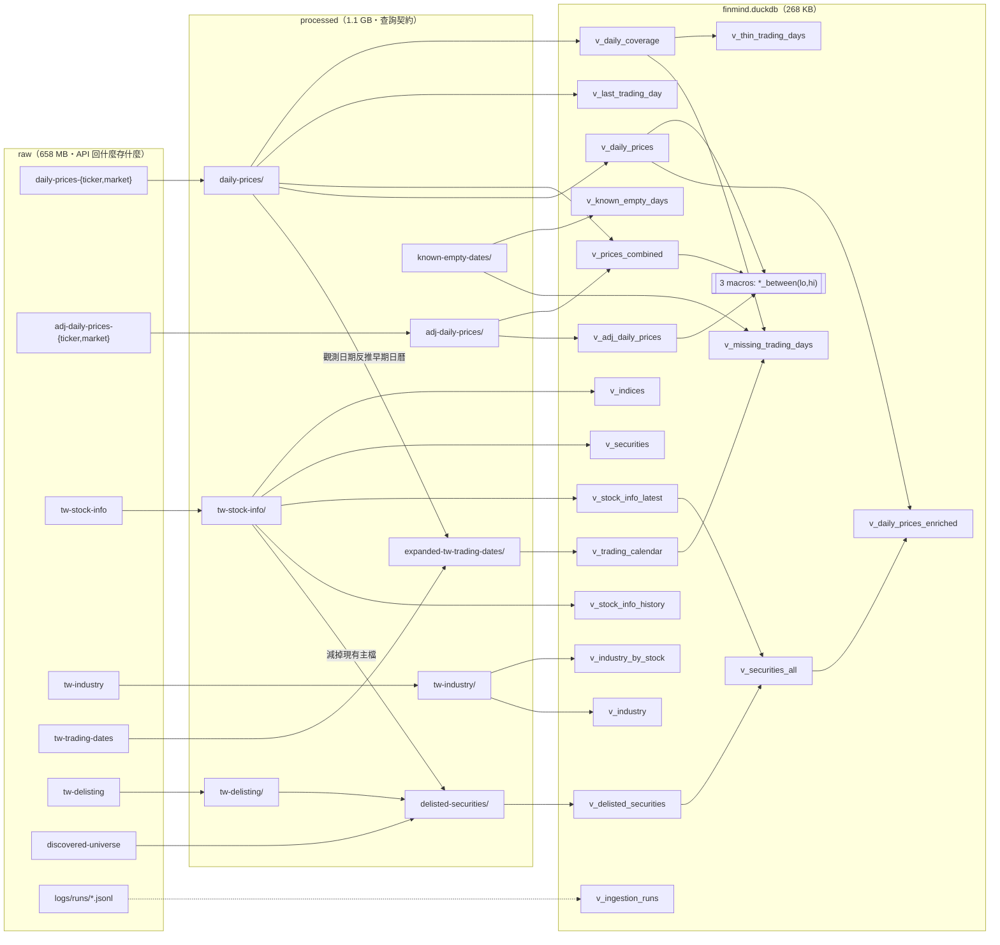
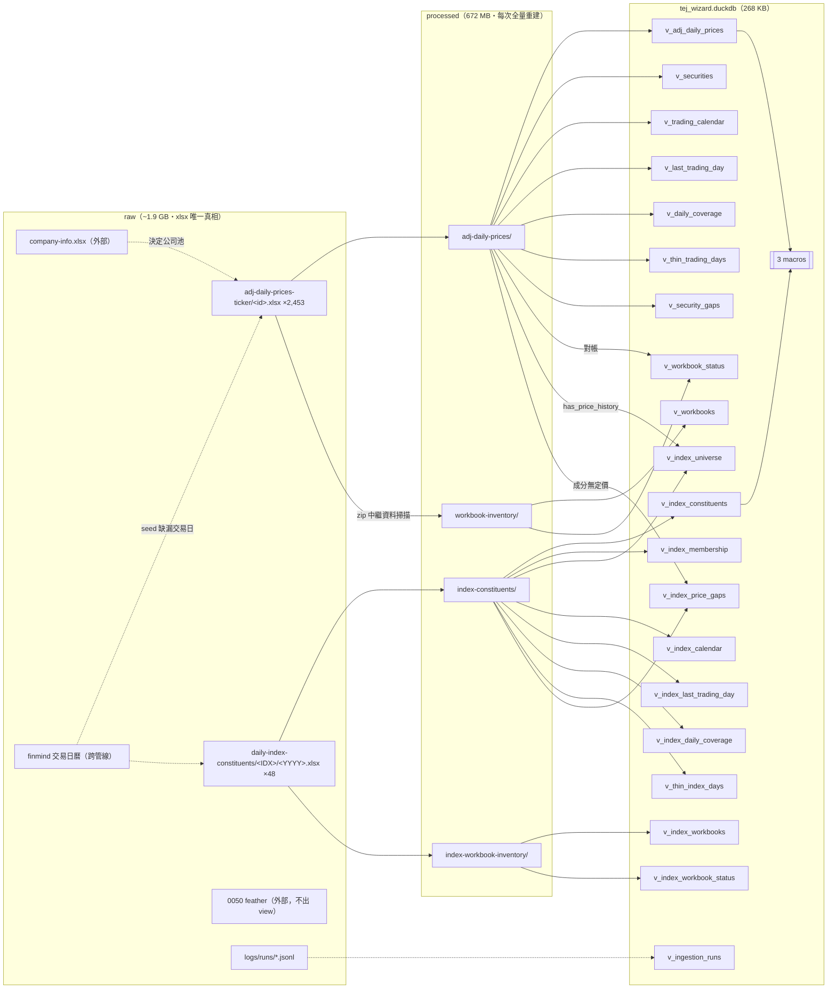

# financial-db Schema 圖

> 兩條管線各一張血緣圖 + 每層每張表的完整欄位。欄位型別直接 dump 自
> `finmind.duckdb`／`tej_wizard.duckdb`（read_only）與 processed/raw Parquet（**2026-09-29**），
> xlsx 欄位契約取自 `tej_pipeline/processing/schema.py`／`index_schema.py`。
> 本文為三層 schema 的 Markdown 版
> （線上版滑鼠移到表上會亮起上下游）。
>
> 標記：**PK** = 自然鍵（去重／唯一性斷言的鍵）・**part** = Hive 分區鍵・
> tstz = `TIMESTAMP WITH TIME ZONE`。列數會隨每日更新變動。

---

# Part 1 · finmind（19 views + 3 macros，零 table）

## 血緣圖

## raw 層（`db/finmind/raw`）

日期都是字串、欄名照上游。價格有 ticker（一檔一檔案）與 market（一天一檔案）兩種形狀，schema 相同。

### `daily-prices-{ticker,market}`（TaiwanStockPrice，3,602+19 檔）／`adj-daily-prices-{ticker,market}`（TaiwanStockPriceAdj，3,154+19 檔）

| 欄位 | 型別 |
|---|---|
| date | varchar |
| stock_id | varchar |
| Trading_Volume | bigint |
| Trading_money | bigint |
| open / max / min / close / spread | double |
| Trading_turnover | bigint |

### 維度快照（每檔 = 一次快照）

| 目錄 | 欄位 |
|---|---|
| `tw-stock-info/` | industry_category, stock_id, stock_name, type, date（全 varchar） |
| `tw-industry/` | stock_id, industry, sub_industry, date（全 varchar） |
| `tw-trading-dates/` | date（varchar）・官方日曆 1999-01-05 起 |
| `tw-delisting/` | date, stock_id, stock_name（全 varchar） |
| `discovered-universe/` | stock_id, shape（varchar）; first_seen, last_seen（date）; sample_hits, sampled_days（bigint）; discovered_at（tstz） |

## processed 層（`db/finmind/processed`）

### `daily-prices/`（11,751,428 列・8,069 檔）／`adj-daily-prices/`（11,252,462 列）

`year=YYYY/month=MM/YYYY-MM-DD.parquet`（day 分區）・去重：未還原 market 優先、還原 ticker 優先。

| 欄位 | 型別 | 備註 |
|---|---|---|
| date | date | **PK** |
| stock_id | varchar | **PK** |
| open / high / low / close / spread | double | |
| volume / turnover_value / transactions | bigint | |
| source | varchar | ticker / market |
| ingested_at | tstz | |
| year | bigint | **part** |
| month | varchar | **part**（view 轉 int） |

### 維度

| 目錄 | 列數 | 欄位 | 鍵／語意 |
|---|---|---|---|
| `tw-stock-info/` | 4,331 | snapshot_date（date）; stock_id, stock_name, industry_category, industry_category_norm, type（varchar）; is_index（bool） | 全內容欄位去重・snapshot_date = min()（首見日） |
| `tw-industry/` | 6,892 | stock_id, industry, sub_industry（varchar）; snapshot_date（date） | **PK** (stock_id, industry, sub_industry)・snapshot_date = max() |
| `expanded-tw-trading-dates/` | 8,141 | date（**PK**, date）; source（finmind / derived） | 官方 ∪ 觀測反推（1994–98 含週六）・TEJ 也讀這份 |
| `tw-delisting/` | 723 | stock_id, stock_name（varchar）; delisted_date（date） | DISTINCT・無對外 view，只是原料 |
| `delisted-securities/` | 767 | stock_id（**PK**）, stock_name, shape, source（varchar）; delisted_date, first_seen, last_seen（date） | (掃描 ∪ 公告) − 現有主檔・source = both/discovered/delisting |
| `known-empty-dates/` | 1 | date（**PK**, date）; confirmed_at（tstz） | 日曆說有、實際沒交易 |

## view 層（`finmind.duckdb`）

### 價格

| View | 列數 | 欄位 |
|---|---|---|
| `v_daily_prices` | 11,751,428 | date（**PK**）, stock_id（**PK**）, open, high, low, close, spread（double）, volume, turnover_value, transactions（bigint）, source, ingested_at, year（**part**, int）, month（**part**, int） |
| `v_adj_daily_prices` | 11,252,462 | 同上 14 欄 |
| `v_prices_combined` | 11,751,428 | date（**PK**）, stock_id（**PK**）, open, high, low, close, adj_open, adj_high, adj_low, adj_close, volume, turnover_value, transactions, adj_factor, year（**part**）, month（**part**）・未還原 LEFT JOIN 還原，join 含分區鍵保裁剪 |
| `v_daily_prices_enriched` | 11,751,428 | v_daily_prices 14 欄 + stock_name, industry, type, is_index, is_delisted, delisted_date・產業是「現在」的分類 |

### 證券主檔

| View | 列數 | 欄位 |
|---|---|---|
| `v_stock_info_history` | 4,331 | snapshot_date, stock_id, stock_name, industry_category, industry_category_norm, type, is_index |
| `v_stock_info_latest` | 3,149 | 同上（每檔最新一列）・當下狀態，回測勿用 |
| `v_securities` | 3,117 | 同上（排除指數） |
| `v_indices` | 32 | 同上（只有指數 pseudo-ticker） |
| `v_delisted_securities` | 767 | stock_id（**PK**）, stock_name, delisted_date, shape, first_seen, last_seen, source |
| `v_securities_all` | 3,916 | stock_id（**PK**）, stock_name, industry_category, industry_category_norm, type, is_index, is_delisted, delisted_date・**無存活者偏誤的回測 universe 用這張** |

### 產業／日曆

| View | 列數 | 欄位 |
|---|---|---|
| `v_industry` | 6,892 | stock_id（**PK**）, industry（**PK**）, sub_industry（**PK**）, snapshot_date |
| `v_industry_by_stock` | 2,358 | stock_id（**PK**）, industries（varchar[]）, sub_industries（varchar[]）, last_seen |
| `v_trading_calendar` | 8,141 | date（**PK**）, source, year, month, day_of_week, is_weekend |
| `v_last_trading_day` | 1 | date |

### 維運

| View | 列數 | 欄位 |
|---|---|---|
| `v_daily_coverage` | 8,069 | date（**PK**）, row_count, securities, last_ingested |
| `v_missing_trading_days` | 0 | date |
| `v_thin_trading_days` | 0 | date, row_count, neighbour_median, ratio |
| `v_known_empty_days` | 1 | date, confirmed_at |
| `v_ingestion_runs` | 39 | job, status, started_at, finished_at, duration_seconds, host, metrics（struct×40）, errors（varchar[]）, error_count |

### Macro

`daily_prices_between(lo, hi)`・`adj_daily_prices_between(lo, hi)`・`prices_combined_between(lo, hi)`
——自動加 `year` 述詞裁剪分區，約快 4 倍。日期範圍查詢一律用這個。

---

# Part 2 · tej-wizard（20 views + 3 macros，零 table）

## 血緣圖

## raw 層（`db/tej-wizard/raw`）

### `adj-daily-prices-ticker/<stock_id>.xlsx`（2,453 本・TEJ 表 `waprcd1`・35 欄 A..AI）

一本 = 一檔證券全歷史。中文表頭是逐字驗證的契約。ⓐ = 還原價、ⓤ = 未還原原始報價——混用必錯。

| Excel 欄 | 中文表頭 | → processed 欄名 |
|---|---|---|
| A | 證券代碼 | stock_id + stock_name（切分） |
| B | 年月日 | date |
| C | 開盤價(元) | open ⓐ |
| D | 最高價(元) | high ⓐ |
| E | 最低價(元) | low ⓐ |
| F | 收盤價(元) | close ⓐ |
| G | 成交量(千股) | volume_k_shares |
| H | 成交值(千元) | turnover_k |
| I | 報酬率％ | return_pct |
| J | 週轉率％ | turnover_pct |
| K | 流通在外股數(千股) | shares_outstanding_k |
| L | 市值(百萬元) | market_cap_m |
| M | 最後揭示買價 | bid ⓤ |
| N | 最後揭示賣價 | offer ⓤ |
| O | 報酬率-Ln | return_ln |
| P | 市值比重％ | market_cap_weight_pct |
| Q | 成交值比重％ | turnover_weight_pct |
| R | 成交筆數(筆) | transactions |
| S | 本益比-TSE | pe_tse |
| T | 本益比-TEJ | pe_tej |
| U | 股價淨值比-TSE | pbr_tse |
| V | 股價淨值比-TEJ | pbr_tej |
| W | 漲跌停 | limit_flag |
| X | 股價營收比-TEJ | psr_tej |
| Y | 股利殖利率-TSE | div_yield_tse |
| Z | 現金股利率 | cash_div_yield |
| AA | 股價漲跌(元) | price_change |
| AB | 高低價差% | high_low_spread_pct |
| AC | 次日開盤參考價 | next_ref_price ⓤ |
| AD | 次日漲停價 | next_limit_up ⓤ |
| AE | 次日跌停價 | next_limit_down ⓤ |
| AF | 注意股票(A) | attention_flag |
| AG | 處置股票(D) | disposition_flag |
| AH | 全額交割(Y) | full_delivery_flag |
| AI | 市場別 | market |

### `daily-index-constituents/<INDEX>/<YYYY>.xlsx`（48 本・TEJ 表 `widxs`・10 欄 A..J）

一本 = 一指數一年度（TWN50 25 本 + TM100 23 本）。date 是生效日、資料是前一日的——成分領先價格一個交易日。

| Excel 欄 | 中文表頭 | → processed 欄名 |
|---|---|---|
| A | 公司代碼 | index_id + index_name（切分） |
| B | 年月日 | date |
| C | 成份股 | stock_id + stock_name（切分） |
| D | 指數因子 | index_factor |
| E | 公眾流通係數 | free_float_factor |
| F | 比重上限因子 | cap_factor |
| G | 股數 | shares（股，非千股） |
| H | 指數基值 | index_base_value |
| I | 前日調整收盤價 | prev_adj_close |
| J | 前日市值比重 | prev_weight_pct |

### 外部輸入（本管線不更新）

| 檔案 | 用途 |
|---|---|
| `company-info/company-info.xlsx`（3,555 家） | 決定公司池：曾上 TSE/OTC/創新板且 2000-09-04 後未下市 → 2,451 家 + 2 ETF |
| `daily-0050-constituents/*.feather`（284,362 列） | 只剩 ISIN 與 0050 ETF 自身 review 權重的用途，不出 view |
| finmind `expanded-tw-trading-dates` | 每日 refresh 用它決定 seed 哪些缺漏交易日 |

## processed 層（`db/tej-wizard/processed`）

### `adj-daily-prices/`（10,093,712 列・313 檔）

`year=YYYY/month=MM/YYYY-MM.parquet`（month 分區）・不去重、斷言 `(stock_id, date)` 唯一。

| 欄位 | 型別 | 備註 |
|---|---|---|
| stock_id | varchar | **PK** |
| stock_name | varchar | |
| date | date | **PK** |
| open / high / low / close | double | 還原價 |
| volume_k_shares / turnover_k | double | 千股／千元 |
| return_pct / return_ln / turnover_pct | double | |
| shares_outstanding_k / market_cap_m | double | 千股／百萬元 |
| market_cap_weight_pct / turnover_weight_pct | double | |
| transactions | bigint | |
| pe_tse / pe_tej / pbr_tse / pbr_tej / psr_tej | double | |
| div_yield_tse / cash_div_yield | double | |
| price_change / high_low_spread_pct | double | |
| bid / offer / next_ref_price / next_limit_up / next_limit_down | double | **未還原**原始報價 |
| limit_flag / attention_flag / disposition_flag / full_delivery_flag | varchar | |
| market | varchar | TSE/OTC/REG/TIB/PSB |
| source_file | varchar | 如 `2330.xlsx` |
| ingested_at | tstz | |
| year / month | bigint / varchar | **part**（view 轉 int） |

### `index-constituents/`（834,748 列・291 檔）

month 分區・斷言 `(index_id, date, stock_id)` 唯一、同指數年度檔不得重疊日期。

| 欄位 | 型別 | 備註 |
|---|---|---|
| index_id / index_name | varchar | **PK**（index_id） |
| date | date | **PK** |
| stock_id / stock_name | varchar | **PK**（stock_id） |
| index_factor / free_float_factor / cap_factor | double | |
| shares | double | 股（非千股） |
| index_base_value / prev_adj_close / prev_weight_pct | double | |
| source_file | varchar | 如 `TWN50/2026.xlsx` |
| ingested_at | tstz | |
| year / month | bigint / varchar | **part** |

### `workbook-inventory/`（2,453 列）／`index-workbook-inventory/`（48 列）

只讀 zip 中繼資料的檔案盤點（獨立對帳層）：
source_file（**PK**）, stock_id｜index_id+year, file_bytes, modified_at, sheet_name,
defined_name, defined_range, declared_rows, tej_table, tej_field_count, descending,
query_matches_contract, scanned_at。

## view 層（`tej_wizard.duckdb`）

### 價格

| View | 列數 | 欄位 |
|---|---|---|
| `v_adj_daily_prices` | 10,093,712 | 價格主表 40 欄 = processed 38 欄重排 + year/month 轉 int・順序：date（**PK**）, stock_id（**PK**）, stock_name, open, high, low, close, volume_k_shares, turnover_k, transactions, return_pct, return_ln, turnover_pct, shares_outstanding_k, market_cap_m, market_cap_weight_pct, turnover_weight_pct, pe_tse, pe_tej, pbr_tse, pbr_tej, psr_tej, div_yield_tse, cash_div_yield, price_change, high_low_spread_pct, bid, offer, next_ref_price, next_limit_up, next_limit_down, limit_flag, attention_flag, disposition_flag, full_delivery_flag, market, source_file, ingested_at, year（**part**）, month（**part**） |
| `v_securities` | 2,453 | stock_id（**PK**）, stock_name, market, first_date, last_date, trading_days, is_current |

### 價格涵蓋／對帳

| View | 列數 | 欄位 |
|---|---|---|
| `v_trading_calendar` | 6,425 | date |
| `v_last_trading_day` | 1 | date |
| `v_daily_coverage` | 6,425 | date（**PK**）, row_count, securities, last_ingested |
| `v_thin_trading_days` | 0 | date, row_count, neighbour_median, ratio |
| `v_security_gaps` | 67,707 | stock_id, stock_name, missing_date・存續期內缺漏日（擴充後大增，多為停牌） |
| `v_workbooks` | 2,453 | = workbook-inventory 直出（13 欄） |
| `v_workbook_status` | 2,453 | stock_id（**PK**）, stock_name, source_file, modified_at, first_date, last_date, trading_days, declared_rows, rows_delta, is_current, days_behind, query_matches_contract, file_mb・inventory ⨝ processed 對帳 |

### 指數成分

| View | 列數 | 欄位 |
|---|---|---|
| `v_index_constituents` | 834,748 | 成分主表 16 欄 = processed 重排 + 分區鍵轉 int・point-in-time 權威來源 |
| `v_index_membership` | 462 | index_id（**PK**）, stock_id（**PK**）, stock_name, first_date, last_date, days_in_index, latest_weight_pct, is_current |
| `v_index_universe` | 367 | stock_id（**PK**）, stock_name, in_twn50, in_tm100, first_date, last_date, has_price_history |
| `v_index_calendar` | 11,337 | index_id, date |
| `v_index_last_trading_day` | 2 | index_id, date（成分領先價格一個交易日） |
| `v_index_daily_coverage` | 11,337 | index_id（**PK**）, date（**PK**）, constituents, distinct_stocks, total_weight_pct, last_ingested |
| `v_thin_index_days` | 0 | index_id, date, constituents, neighbour_median, ratio |
| `v_index_price_gaps` | 39 | index_id, date, stock_id, stock_name, has_price_history・全是併購停牌 |
| `v_index_workbooks` | 48 | = index-workbook-inventory 直出（14 欄） |
| `v_index_workbook_status` | 48 | index_id, year, source_file, modified_at, first_date, last_date, sessions, parsed_rows, declared_rows, rows_delta, is_current_year, query_matches_contract, file_mb |

### 維運

| View | 列數 | 欄位 |
|---|---|---|
| `v_ingestion_runs` | 54 | job, status, started_at, finished_at, duration_seconds, host, metrics（struct×35）, errors（varchar[]）, error_count |

### Macro

`adj_daily_prices_between(lo, hi)`・`index_constituents_between(lo, hi)`・
`index_members_on(idx, as_of)`——回測歷史指數用最後這個取當日成分。
