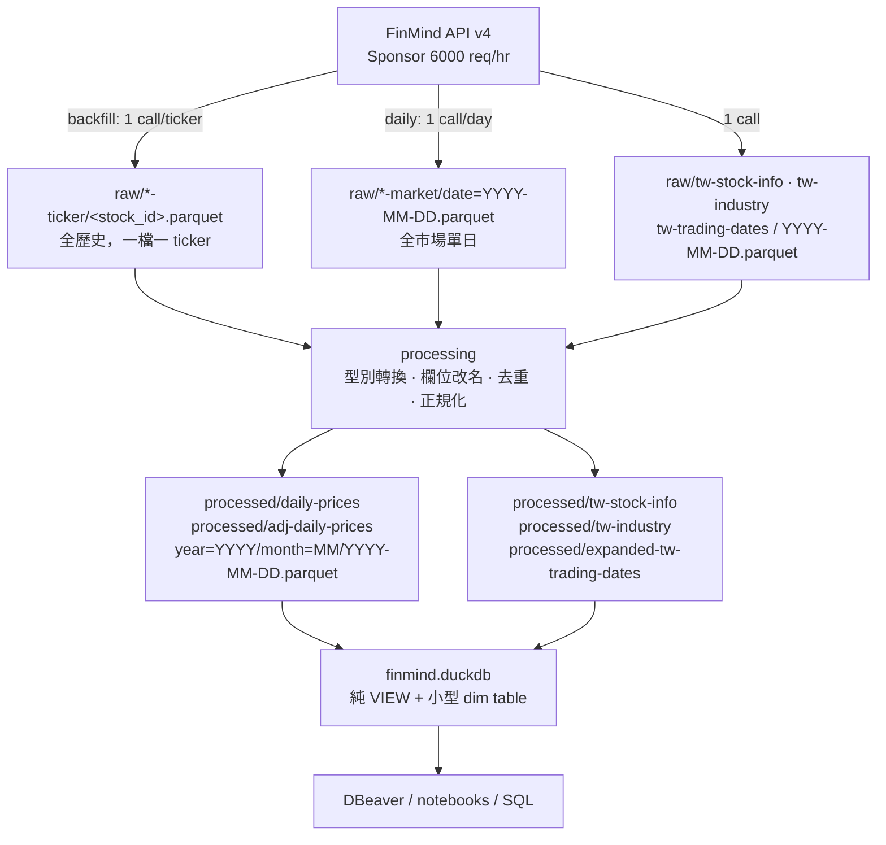

# FinMind → Parquet → DuckDB 資料管線建置計畫

> ⚠️ **歷史文件，不再更新（原始規格寫於 2026-08-26，全部 Phase 已完成）。**
>
> 保留它是為了記錄當初的決策與取捨，**不要拿它當現況參考**。實作在建置過程中
> 偏離了這份規格，下列項目已被取代——照著做會找不到檔案或建出錯的東西：
>
> | 這份文件寫的 | 實際上 |
> |---|---|
> | `sql/schemas/10_dim_tables.sql`（`dim_trading_calendar` / `dim_security` / `dim_industry`） | **不存在**。`finmind.duckdb` 只有 view，不存任何 table——這是現在的核心設計 |
> | `sql/schemas/00_macros.sql` | 改為 `sql/views/27_macros.sql` |
> | `scripts/probe_api.py` | 不存在；probe 結果已寫進 `schema.md` |
> | `utils/calendar.py` | 實際是 `utils/trading_calendar.py` |
> | 每個 dataset 一個 processing 模組 | 合併成 `processing/prices.py` + `processing/dimensions.py` |
> | daily_update「約 5 次呼叫」 | 實測 22 次（見 `operations.md` 成本表） |
>
> 現況請看 [`architecture.md`](architecture.md)、[`data-lineage.md`](data-lineage.md)、
> [`views-guide.md`](views-guide.md)、[`schema.md`](schema.md)。

---

## 進度追蹤

- [x] **Phase 0** — 環境與 repo 整備
- [x] **Phase 1** — 核心 utils + API probe（已完成，結果見 `schema.md`）
- [x] **Phase 2** — ingestion 模組
- [x] **Phase 3** — processing 模組
- [x] **Phase 4** — SQL 與 DuckDB build
- [x] **Phase 5** — 排程腳本與 Task Scheduler
- [x] **Phase 6** — 測試
- [x] **Phase 7** — 文件
- [x] **Phase 8** — 首次全量 backfill 與上線

---

## Context

本專案要建立個人財經資料庫，架構為 **Python 抓取 → Parquet 儲存 → DuckDB 查詢**，第一個資料來源是 FinMind（台股）。

**現況：專案是純骨架，0% 實作。** 26 個空資料夾、零行 Python、零 Parquet、無 venv、無 `pyproject.toml`。唯二有內容的檔案是 FinMind 官方 agent 指引文件與一個只會印目錄樹的 notebook。憑證已就緒（`.env`，Sponsor 方案 6000 req/hr）。

**目標**：把骨架填成一個可每日自動執行、可重建、可驗證的資料管線，涵蓋 5 個資料集（daily prices、adj daily prices、stock info、industry、trading dates）。

**技術分工**

| 元件 | 職責 |
|---|---|
| Python | 抓取與處理資料 |
| Parquet | 大量資料儲存（唯一真相） |
| DuckDB | SQL 查詢與資料整合（純 view 層，可拋棄重建） |
| Windows Task Scheduler | 每日/每週自動執行 |
| DBeaver / Mermaid | 資料庫與 pipeline 視覺化 |

**環境事實（已驗證）**
- Git repo 根目錄在 `data-pipelines/`，branch `main`。`db/` 不在任何 repo 內。
- Python：`py` launcher 指向 `C:\Users\<you>\AppData\Local\Programs\Python\Python312\python.exe`（3.12.4），已有 pandas 2.2.2 / pyarrow 25.0.1 / requests 2.32.4；**缺 duckdb、python-dotenv、tenacity、PyYAML、pytest**。PATH 上的 `python` 是 MSYS2 3.12.12，套件全缺 —— **不要用它**。
- `.env` 三個 key：`FINMIND_TOKEN`、`FINMIND_API_HOUR_LIMIT=6000`、`FINMIND_SUBSCRIPTION_PLAN="Sponsor"`（值含字面雙引號，必須用 `python-dotenv` 解析，不可自己 `split("=")`）。
- Sponsor **不含** Sponsor Pro 的 `use_object=True` 全市場 parquet 下載；tick/kbar 不在本次範圍。

---

## 已定案的架構決策

| 決策 | 結論 |
|---|---|
| 檔案格式 | **Parquet + zstd**，不用 Feather。DuckDB 原生 glob、predicate/projection pushdown、hive partitioning；Feather 三者皆無且壓縮率差 3–5×。 |
| adj price 更新 | **每週全量重抓 + 平日 append**。全量前先更新 stock_info 取得最新 ticker universe。 |
| raw 佈局 | **分兩個子資料夾**：`*-ticker/`（backfill，一檔一 ticker 全歷史）與 `*-market/`（每日全市場單日）。raw 永遠 append-only。 |
| 排程 | **Windows Task Scheduler** + `.bat` wrapper。GitHub Actions 只做 CI（選配）。 |
| DuckDB 定位 | **純 view 層**，可用 `scripts/build_db.py` 隨時從 `sql/` 重建。資料唯一真相在 Parquet。 |

---

## 對原始資料夾規劃的 3 個必要修改

1. **`src/` 底下改 snake_case，且不要一個 dataset 一個資料夾。**
   `from src.ingestion.tw-stock-info import x` 是 Python 語法錯誤。每個 dataset 只需一個模組檔，不需要資料夾。
   `src/ingestion/tw-stock-info/` → `src/finmind_pipeline/ingestion/tw_stock_info.py`

2. **`src/` 內加一層 package 名 `finmind_pipeline`**（標準 src-layout）。
   讓 `pip install -e .` 直接可用、import 路徑穩定（`from finmind_pipeline.utils.parquet_io import ...`），且不會和 PyPI 上的 `FinMind` 套件名撞名。
   `db/`、`raw/`、`processed/` 的資料夾名**維持 kebab-case 不動**（那是路徑不是 import）。

3. **`db/finmind/` 新增 5 個資料夾**：
   `raw/daily-prices-market/`、`raw/adj-daily-prices-market/`、`processed/tw-stock-info/`、`processed/tw-industry/`，外加 `state/`（rate limiter 與 backfill checkpoint）。

---

## 樣本資料揭露的必修資料品質問題

以下全部是從 `db/finmind/temp/*.feather` 六個樣本檔實測出來的。實作時**必須**在 processing 層處理，測試要覆蓋：

| 問題 | 處理方式 |
|---|---|
| 6 個檔案的 `date` 全是 string | processing 層一律 `CAST` 成 `DATE` |
| `tw_stock_info` 有 32 列 `date` 是**字面字串 `"None"`**（不是 null） | `df["date"].replace("None", pd.NA)` 後再轉型；**絕不可**用 `CAST(date AS DATE)`，會炸 |
| `stock_id` 非數值、maxlen 32 | 一律 VARCHAR。`0050` 前導零有意義；含 `00679B`、`TradingConsumersGoods`、`TPEx` 等 |
| 欄名 `max` / `min` | processed 層改名 `high` / `low` |
| `Trading_money` max = 52,822,527,292 | 超過 int32 → BIGINT。`Trading_Volume` 也用 BIGINT |
| dim 無單欄 PK | `tw_industry` key = `(stock_id, industry, sub_industry)`；`tw_stock_info` 是 SCD 快照 log，有 630 組重複 `(stock_id, date)` |
| industry 詞彙髒 | `創新板股票` vs `創新版股票`（來源錯字），及 `其他電子業/其他電子類`、`居家生活/居家生活類`、`數位雲端/數位雲端類`、`綠能環保/綠能環保類`、`運動休閒/運動休閒類`、`農業科技/農業科技業`、`金融保險/金融業` 共 7 組。建 `config/industry_alias.yml` 對照表，processed 層加 `industry_category_norm` 欄 |
| 兩份 price 檔日期範圍不對齊、同日數值有差異 | 永遠用 `(stock_id, date)` join，**不可**假設可逐列對齊 |

**樣本檔基準值**（測試用 golden data）：

| 檔案 | shape | date 範圍 |
|---|---|---|
| `daily_price_example_0050.feather` | (5694, 10) | 2003-06-30 → 2026-08-20 |
| `adj_price_example_0050.feather` | (5694, 10) | 2003-07-01 → 2026-08-21 |
| `tw_industry_example.feather` | (6867, 4) | 2025-03-30 → 2026-08-20 |
| `tw_stock_info_example.feather` | (4306, 5) | 2020-06-03 → 2026-08-20（含 32 個 `"None"`） |
| `tw_trading_date_example.feather` | (6937, 1) | 1999-01-05 → 2026-12-31 |
| `tw_trading_date_expanded_example.feather` | (8141, 1) | 1994-10-01 → 2026-12-31 |

擴充後多出的 1204 天全部落在 1994-10-01 ~ 1998-12-31，且原集合是擴充集合的嚴格子集。

---

## 資料流



**分層契約**
- `raw/` = API 回什麼就存什麼，**只新增不修改**。欄名、型別、字串日期原樣保留。
- `processed/` = 唯一的查詢真相。型別正確、欄名統一、已去重。**完全可從 raw 重建**。
- `finmind.duckdb` = 只有 view 與小 dim table，可拋棄、可重建，檔案僅數 MB。

---

## 儲存佈局（最終）

### `<repo>\db\finmind\`

```
finmind.duckdb
state/            rate_limit.json · backfill_checkpoint.json
logs/
  ingestion/YYYY-MM-DD.log
  processing/YYYY-MM-DD.log
  runs/YYYY-MM-DD_<job>.jsonl        ← 結構化 run manifest（lineage 用）
raw/
  daily-prices-ticker/<stock_id>.parquet
  daily-prices-market/date=YYYY-MM-DD.parquet
  adj-daily-prices-ticker/<stock_id>.parquet
  adj-daily-prices-market/date=YYYY-MM-DD.parquet
  tw-stock-info/YYYY-MM-DD.parquet
  tw-industry/YYYY-MM-DD.parquet
  tw-trading-dates/YYYY-MM-DD.parquet
processed/
  daily-prices/year=YYYY/month=MM/YYYY-MM-DD.parquet
  adj-daily-prices/year=YYYY/month=MM/YYYY-MM-DD.parquet
  tw-stock-info/tw_stock_info.parquet
  tw-industry/tw_industry.parquet
  expanded-tw-trading-dates/expanded_tw_trading_dates.parquet
notebooks-outputs/
temp/            （現有 6 個 feather 樣本保留，測試用 golden fixture，不要刪）
```

**分區說明**：`year=/month=/YYYY-MM-DD.parquet` 每檔約 1500 列。約 8100 個檔、總計預估 150–250 MB。

一天一檔的關鍵好處是**每日更新是純新增檔案、天然冪等、中斷不會弄壞既有資料**。

**（實測修正）** 原先假設「一檔一天，所以 parquet footer 的 min/max 會讓 `date` 篩選自動 pruning」——**這是錯的**。Hive key 只有 `year`/`month`，DuckDB 無法從 `date` 推導出來，實測會開啟全部 8,053 個 footer（三個月區間 0.56 秒）。加上 `year BETWEEN` 才會做目錄層 pruning（0.13 秒，快 4.3 倍）。

注意 `(year*100+month) BETWEEN ...` 這種算術寫法**不會** pruning——DuckDB 不會把分區欄上的運算式下推到檔案列舉階段。

已提供 `daily_prices_between(lo, hi)` / `adj_daily_prices_between(lo, hi)` 兩個 table macro 自動套用此規則。`year`/`month` 也已在 view 中曝露為欄位，`date` 欄**保留在檔案內**。

**檔名安全**：`stock_id` 可能是 `TradingConsumersGoods` 這類字串。寫檔前過濾 Windows 保留名（`CON`/`PRN`/`AUX`/`NUL`/`COM1-9`/`LPT1-9`）與非法字元，撞到就前綴 `_`。

---

## 程式碼佈局

### `<repo>\pipelines\finmind\`

```
pyproject.toml                     ← 新增
.env                               ← 現有，gitignored
.env.example                       ← 新增，committed
config/
  paths.yml                        db 根目錄、各 dataset 路徑
  datasets.yml                     dataset registry（FinMind 名稱、endpoint、分區、schema）
  industry_alias.yml               產業別正規化對照
docs/
  BUILD_PLAN.md                    ← 本檔
  architecture.md                  ← mermaid 架構圖
  schema.md                        ← 每個 dataset 的欄位契約 + probe 結果
  data-lineage.md                  ← mermaid lineage 圖
  operations.md                    ← Task Scheduler 設定 + runbook
  finmind_official_guidance_for_ai_agents.md   （現有）
notebooks/test.ipynb               （現有）
scripts/
  probe_api.py                     ← Phase 1 必跑：驗證全市場單日呼叫
  backfill.py                      一次性全歷史回補（可續跑）
  daily_update.py                  每日排程進入點
  weekly_refresh.py                每週排程進入點
  build_db.py                      從 sql/ 重建 finmind.duckdb
  daily_update.bat                 Task Scheduler 呼叫的 wrapper
  weekly_refresh.bat
sql/
  schemas/00_macros.sql            路徑巨集、共用 helper
  schemas/10_dim_tables.sql        dim_trading_calendar / dim_security / dim_industry
  views/20_v_trading_calendar.sql
  views/21_v_stock_info.sql        v_stock_info_history + v_stock_info_latest
  views/22_v_industry.sql
  views/23_v_daily_prices.sql
  views/24_v_adj_daily_prices.sql
  views/25_v_ingestion_runs.sql    讀 logs/runs/*.jsonl
  queries/examples.sql
src/finmind_pipeline/
  __init__.py
  settings.py                      載入 .env + config/*.yml，回傳 typed Settings
  utils/
    __init__.py
    finmind_client.py              requests 封裝，含 402/429/5xx 重試
    rate_limiter.py                跨行程 token bucket（state/rate_limit.json）
    parquet_io.py                  原子寫入、zstd、schema enforcement
    logging_setup.py               檔案 + console logger
    run_manifest.py                寫 logs/runs/*.jsonl
    calendar.py                    交易日曆載入與運算
  ingestion/
    __init__.py
    tw_stock_info.py  tw_industry.py  tw_trading_dates.py
    daily_prices.py   adj_daily_prices.py
  processing/
    __init__.py
    schema.py                      正規 schema + 欄名對照（單一真相）
    daily_prices.py   adj_daily_prices.py
    stock_info.py     industry.py   expanded_trading_dates.py
  database/
    __init__.py
    build.py                       依序執行 sql/ 檔案
tests/
  conftest.py                      指向 db/finmind/temp/*.feather
  test_schema.py  test_parquet_io.py  test_rate_limiter.py
  test_processing_prices.py  test_stock_info_none_dates.py
  test_calendar_expansion.py
```

---

## 正規 Schema（processed 層）

`processing/schema.py` 是唯一真相，parquet 寫入與 DuckDB view 都從它衍生。

### daily_prices / adj_daily_prices（兩者同 schema）

| 欄位 | 型別 | 來源欄名 |
|---|---|---|
| `date` | DATE | `date` |
| `stock_id` | VARCHAR | `stock_id` |
| `open` | DOUBLE | `open` |
| `high` | DOUBLE | `max` |
| `low` | DOUBLE | `min` |
| `close` | DOUBLE | `close` |
| `spread` | DOUBLE | `spread` |
| `volume` | BIGINT | `Trading_Volume` |
| `turnover_value` | BIGINT | `Trading_money` |
| `transactions` | BIGINT | `Trading_turnover` |
| `source` | VARCHAR | `'market'` \| `'ticker'` |
| `ingested_at` | TIMESTAMP | 寫入時間（UTC） |

去重鍵 `(stock_id, date)`；衝突時 `source='market'` 勝出（當日 API 為最終值），同 source 取 `ingested_at` 最大者。

### tw_stock_info
`snapshot_date DATE`(nullable) · `stock_id VARCHAR` · `stock_name VARCHAR` · `industry_category VARCHAR` · `industry_category_norm VARCHAR` · `type VARCHAR` · `is_index BOOLEAN`

`is_index` 判定：`type`/`industry_category` 落在 `Index`/`大盤`/`所有證券`，或 `snapshot_date IS NULL`。

### tw_industry
`stock_id VARCHAR` · `industry VARCHAR` · `sub_industry VARCHAR` · `snapshot_date DATE`

### expanded_trading_dates
`date DATE` · `source VARCHAR`（`'finmind'` \| `'derived'`）

---

## 每日 / 每週工作邏輯

### 每日（Task Scheduler，週一～週六 18:30 台北時間）

```
1. tw_stock_info          → 1 call → raw/tw-stock-info/<today>.parquet
2. tw_industry            → 1 call
3. tw_trading_dates       → 1 call
4. daily-prices  當日全市場（不帶 data_id）→ 1 call → raw/daily-prices-market/date=<D>.parquet
5. adj-daily-prices 當日全市場              → 1 call → raw/adj-daily-prices-market/date=<D>.parquet
6. 日期缺口自癒：比對 processed 的 distinct date vs 交易日曆，
   缺的日期逐日重抓全市場（1 call/缺日）。正常情況 0 call。
7. processing：更新 processed 的當日與缺口日檔案 + 三個 dim
8. build_db.py 重建 view
9. 寫 run manifest；非零退出碼時 log 出 ERROR
```

正常每日成本：**5 次 API call、數秒**。

### 每週（Task Scheduler，週日 02:00）

順序**必須**如下（全量前先更新 stock_info，才能涵蓋新上市股）：

```
1. 先跑 tw_stock_info + tw_trading_dates + tw_industry
2. ticker_universe = 最新 stock_info 快照中 type ∈ (twse, tpex, emerging)
   且 is_index = false 的 distinct stock_id   ← 這樣才含新上市股
3. adj 全量：對每個 ticker 抓 1994-10-01 → today 全歷史
   → 原子覆寫 raw/adj-daily-prices-ticker/<id>.parquet
   （~3135 calls ≈ 40 分鐘 @ 5400/hr 節流）
4. processed/adj-daily-prices 整個重建（staging 目錄建好再置換）
5. daily-prices 對帳（見下）
6. 重建 expanded trading calendar + build_db.py
7. 驗證 + 寫 run manifest
```

### daily-prices 每週對帳邏輯

核心洞察：daily price 的 raw 全市場單日拉取是**權威且不可變**的，所以對帳不需要逐檔啟發式，只要比對「日期集合」即可。

```
A. 日期層缺口
   expected = 交易日曆 ∩ [min(processed.date), 最後一個已收盤交易日]
   actual   = SELECT DISTINCT date FROM v_daily_prices
   missing  = expected − actual
   → 每個缺日重抓全市場（1 call/日）

B. 稀疏日偵測（抓半寫失敗）
   對每個日期算 row count；若 < 前後各 5 個交易日 row count 中位數的 50%
   → 該日視為污染，重抓全市場並覆寫

C. 零列 ticker
   ticker_universe 中在 v_daily_prices 完全沒有任何列的 stock_id
   → 逐檔全歷史回補（1 call/檔）
   捕捉：新上市當天排程失敗、下市後復牌

D. 落後 ticker
   仍在最新 stock_info 快照、但 max(date) < 最後交易日 − 20 個交易日 的 stock_id
   → 逐檔全歷史重抓
   捕捉：長期停牌後復牌、靜默漏抓

E. 對帳報告寫入 logs/runs/，列出 A–D 各觸發了哪些日期/ticker 與修補結果
```

A、B 正常情況下 0 call；C、D 是長尾保險。每週總成本 ≈ 3140 calls ≈ 40 分鐘。

### 選配增強（強烈建議做，成本近乎為零）

每日多抓一次 `TaiwanStockDividendResult`（1 call），取出「今日除權息」的 ticker 清單，只對這幾檔（通常個位數）立即全量重抓 adj。這樣 adj 幾乎即時正確，每週全量退化為保險機制而非正確性依賴。

---

## 關鍵實作細節

### FinMind client（`utils/finmind_client.py`）
- 直接用 `requests` 打 `https://api.finmindtrade.com/api/v4/data`，**不用 FinMind SDK** —— SDK 內建隱藏的節流行為會與我們的 token bucket 打架，且官方指引本身也是示範 raw requests。
- 檢查 HTTP 402（配額用盡）與 JSON body 的 `status != 200`（印 `msg`）。
- `tenacity`：指數退避重試 5xx / timeout；402 改為長等待（等到下一個整點窗口）。
- 啟動時打 `https://api.web.finmindtrade.com/v2/user_info` 記錄剩餘配額到 log。

### Rate limiter（`utils/rate_limiter.py`）
- Token bucket，狀態持久化在 `db/finmind/state/rate_limit.json`，含檔案鎖，讓多個腳本共用同一份額度。
- 預算取 `FINMIND_API_HOUR_LIMIT` 的 90%（6000 → 5400/hr）。

### 原子寫入（`utils/parquet_io.py`）
- 一律先寫 `<target>.tmp` 再 `os.replace()`。壓縮 `zstd` level 3。
- 寫入前用 `processing/schema.py` 的 pyarrow schema 強制轉型，型別不符直接 raise。
- 目錄級置換（adj 全量重建）：寫入 `<dataset>__staging/` → `shutil.rmtree(live)` → `os.rename(staging, live)`，前後都寫 log。

### backfill 續跑（`scripts/backfill.py`）
- `state/backfill_checkpoint.json` 記錄已完成的 ticker，`--resume` 跳過。
- 全量 backfill = 3135 × 2 = 6270 calls ≈ 75 分鐘。

### DuckDB 連線
- 排程腳本用短連線：開 → 重建 view → 立刻關。
- 探索（DBeaver / notebook）用 `read_only=True`，避免單寫入者鎖衝突。`operations.md` 要寫清楚這點。

### .gitignore 補強
現在只擋 `.env`，太少。新增：
```
__pycache__/
*.pyc
.venv/
.ipynb_checkpoints/
*.duckdb
*.duckdb.wal
*.parquet
*.feather
.pytest_cache/
.ruff_cache/
```

---

## 實作階段

| Phase | 內容 | 產出 |
|---|---|---|
| **0** | 建 `.venv`（用 `py -3.12 -m venv`，**不要**用 PATH 上的 MSYS2 python）；`pyproject.toml` 列 deps：`duckdb pandas pyarrow requests python-dotenv PyYAML tenacity pytest ruff`；`pip install -e .`；補 `.gitignore`；寫 `.env.example`；建新增的 db 資料夾 | 可 import 的空 package |
| **1** | `settings.py` + `utils/*` 全部 + `scripts/probe_api.py` | **probe 必須先跑**（見下） |
| **2** | 5 個 ingestion 模組。price 類要能 (a) 全市場單日 (b) 逐檔全歷史 | raw parquet 產出 |
| **3** | `processing/schema.py` 先寫，再寫 5 個 processing 模組 | processed parquet 產出 |
| **4** | `sql/schemas/` + `sql/views/` + `database/build.py` + `scripts/build_db.py` | 可查詢的 finmind.duckdb |
| **5** | `backfill.py` / `daily_update.py` / `weekly_refresh.py` + 兩個 `.bat` + Task Scheduler 設定文件 | 可排程 |
| **6** | pytest 全套，fixture 用 `db/finmind/temp/*.feather` 當 golden data | 綠燈 |
| **7** | `docs/` 四份含 mermaid | 文件 |
| **8** | 實跑 backfill（~75 分鐘）→ 驗證 → git commit + push | 上線 |

### Phase 1 的 probe —— 已執行完畢（2026-08-26）

實測結果如下，已寫入 `schema.md`。**這些是事實，不是假設。**

| 項目 | 結果 |
|---|---|
| 不帶 `data_id` 的全市場單日 | ✅ 成立，raw 與 adj 皆可 → 每日更新確定是少數幾次 call |
| 單檔全歷史 | ✅ 無筆數上限。`2330` 一次回 8,053 列（1994-10-01 起） |
| **多日區間 + 無 `data_id`** | ❌ `end_date` 被忽略，只回 `start_date` 當天 |
| `TaiwanStockPrice` 單日 | 43,727 列，**其中僅 2,813 檔在 stock_info 內** |
| `TaiwanStockPriceAdj` 單日 | 2,805 列，是 stock_info 宇宙的嚴格子集 |

### probe 造成的 4 項設計修正

1. **每日全市場拉取必須過濾到 stock_info 宇宙。** 單日回 43,727 檔，其中 40,914
   檔是權證/TDR（38,214 檔為 6 位數代碼權證），且單日 23,130 列成交量為 0。
   已在 `ingestion/prices.py` 實作，由 `config/datasets.yml` 的
   `filter_to_universe` 控制。

2. **`所有證券` 不是指數類別。** 原先誤列入 `index_categories`，實測發現它標記的是
   36 檔代碼為數字的權證（`708785 信驊中信9B購01` 等）。真正的指數類別只有
   `Index`(30) + `大盤`(2)，剛好等於那 32 個 `date="None"` 的列。已修正。

3. **指數偽代碼有真實價量歷史，不是空殼。** `TAIEX` 6,849 列、`TPEx` 5,321 列、
   `TradingConsumersGoods` 4,608 列。因此**照常納入抓取範圍**，只打上 `is_index`
   讓查詢能區分，而非排除。

4. **FinMind 會在收盤後修訂當日數值。** `0050` 的 2026-08-20 成交量從 39,946,000
   被改為 43,382,378（價格不變）。因此每日工作必須**重抓最近 3 個交易日並覆寫**，
   不能只補缺漏日。已在 `daily_update.py` 以 `--revision-window` 實作。

### 其他實作中發現、原計畫未涵蓋的事項

- **令牌桶的 burst 與 rate 必須分開設定（實跑時真的爆掉了）。**
  桶子在被消耗的同時也在回填，所以任一長度 W 的視窗內最多放行
  `burst + rate*W`。原本 `burst = rate = 5400`，等於允許每小時 10,800 次，
  是預期預算的兩倍。第一次全量 backfill 就在第 41 分鐘吃到 HTTP 402，
  FinMind 回報 `6002/6000`。正確做法是 `burst = 方案上限 - 持續速率`
  （600 = 6000 - 5400），把任一滾動小時嚴格壓在 6000。
  副作用：backfill 不再前段暴衝，全程走持續速率，約需 70–80 分鐘。
- **402 不該殺掉整個 run。** 已加上退避重試：每次被拒就把本地桶清空
  （以供應商的計數為準）再等待重試，預設有約 35 分鐘的容忍度。

- **`safe_filename` 的碰撞。** 原本把 Windows 保留名前綴底線，會讓 `CON` 與 `_CON`
  對應到同一個檔名而合併兩檔的歷史。已改為在任何需要改寫時附加原字串的短雜湊，
  保證單射。實際 stock_id 全部原樣不變。
- **Windows 目錄改名會被短暫鎖住。** staged 置換時 `os.rename` 偶發 WinError 5
  （防毒即時掃描新寫入的 parquet）。已加上指數退避重試。
- **DuckDB 1.5 的 `.arrow()` 回傳 RecordBatchReader**，不是 Table；且
  `fetch_arrow_table()` 已棄用。統一改用 `to_arrow_table()`。
- **pandas 解析為 3.0.5**（非 2.2）。所有轉換都走 pyarrow/DuckDB，不依賴 pandas 語意。

## 需要改動 / 新建的關鍵檔案

**新建**（全部都是新檔，無既有程式碼需修改）：
- `data-pipelines/finmind/pyproject.toml`
- `data-pipelines/finmind/src/finmind_pipeline/` 整棵樹（見上方佈局）
- `data-pipelines/finmind/config/{paths,datasets,industry_alias}.yml`
- `data-pipelines/finmind/sql/{schemas,views,queries}/*.sql`
- `data-pipelines/finmind/scripts/*.py` + `*.bat`
- `data-pipelines/finmind/tests/*.py`
- `data-pipelines/finmind/docs/{architecture,schema,data-lineage,operations}.md`

**修改**：
- `data-pipelines/.gitignore`（補強，見上）
- `data-pipelines/README` → 改名 `README.md` 並寫入專案說明

**刪除既有空資料夾**：`src/ingestion/*/`、`src/processing/*/`（kebab-case 那些），由新的 `.py` 模組取代。

---

## 驗證

每個 Phase 完成後都要能跑通對應項目。以下指令都在 `<repo>\pipelines\finmind` 執行。

### Phase 0–1
```powershell
.\.venv\Scripts\python.exe -c "import finmind_pipeline, duckdb, pyarrow, pandas; print('ok')"
.\.venv\Scripts\python.exe scripts\probe_api.py     # 印出三個 probe 的實際結果
```

### Phase 2–3（小規模驗證，別直接跑全量）
```powershell
.\.venv\Scripts\python.exe scripts\backfill.py --tickers 0050,2330 --dry-run
.\.venv\Scripts\python.exe scripts\backfill.py --tickers 0050,2330
```
斷言：
- `raw/daily-prices-ticker/0050.parquet` 列數 ≈ 5694（樣本值），日期 `2003-06-30` → 今日
- `raw/adj-daily-prices-ticker/0050.parquet` 同上
- processed 0050 的 2003-07-01 那筆 `open == 37.09`（raw）/ `4.427356`（adj）—— 與 `db/finmind/temp/` 的 feather 樣本逐值比對
- processed 的 `date` 是 DATE 型別、`stock_id` 是 VARCHAR、`high`/`low` 欄存在且無 `max`/`min`

### Phase 4
```powershell
.\.venv\Scripts\python.exe scripts\build_db.py
```
```sql
-- duckdb -readonly "<repo>\db\finmind\finmind.duckdb"
SELECT count(*), min(date), max(date), count(DISTINCT stock_id) FROM v_daily_prices;
SELECT * FROM v_stock_info_latest WHERE stock_id = '2330';
SELECT count(*) FROM v_stock_info_history WHERE snapshot_date IS NULL;  -- 應為 32（"None" 已轉 NULL）
SELECT count(*) FROM v_trading_calendar;                                 -- 應 >= 8141
-- 確認 file pruning 生效
EXPLAIN ANALYZE SELECT count(*) FROM v_daily_prices WHERE date BETWEEN '2024-01-01' AND '2024-01-31';
```

### Phase 6
```powershell
.\.venv\Scripts\python.exe -m pytest tests -v
```
必須涵蓋：
- `"None"` 日期轉 NULL（32 列）
- `0050` 前導零不遺失
- `max`/`min` → `high`/`low` 改名
- `(stock_id, date)` 去重且 `source='market'` 勝出
- trading calendar 擴充後多出 1204 天、全落在 1999 之前、原集合是子集
- rate limiter 節流正確
- 原子寫入中斷不留半檔

### Phase 8（端到端）
```powershell
.\.venv\Scripts\python.exe scripts\backfill.py            # 全量，~75 分鐘，可 --resume
.\.venv\Scripts\python.exe scripts\daily_update.py
.\.venv\Scripts\python.exe scripts\weekly_refresh.py --dry-run
```
斷言：
- `processed/daily-prices/` 檔案數 ≈ 交易日數；2026-08-21 當日應為 2,813 列（adj 為 2,805）
- `SELECT count(*) FROM v_daily_prices` 約 10M 量級
- 對帳報告（`logs/runs/*.jsonl`）顯示 A–D 四項缺口皆為 0
- **自癒實測**：刻意刪掉 `processed/daily-prices/year=2024/month=03/2024-03-15.parquet` 後重跑 `daily_update.py`，該檔應被自動補回

**排程驗證**：在 Task Scheduler 建好兩個工作後，用「立即執行」各跑一次，確認 `.bat` 退出碼為 0 且 `logs/` 有當日檔案。

---

## 給實作 agent 的注意事項

1. **git 操作一律在 `<repo>\pipelines`**（那才是 repo 根），不要在 `financial-db/` 或 `db/` 下 `git init`。
2. **絕不 commit `.env`、任何 parquet / duckdb / feather**。push 前跑 `git status` 確認。
3. **Python 一律用 `.venv\Scripts\python.exe`**，不要用 PATH 上的 `python`（MSYS2，套件全缺）。
4. probe 結果與實際 API 行為若與本計畫假設不符，**先回報再改設計**，不要默默調整。
5. 每個 Phase 結束時更新本檔頂端的進度勾選，並做一次 commit。
6. `db/finmind/temp/` 的 6 個 feather 樣本是測試 fixture，**不要刪除或覆寫**。
