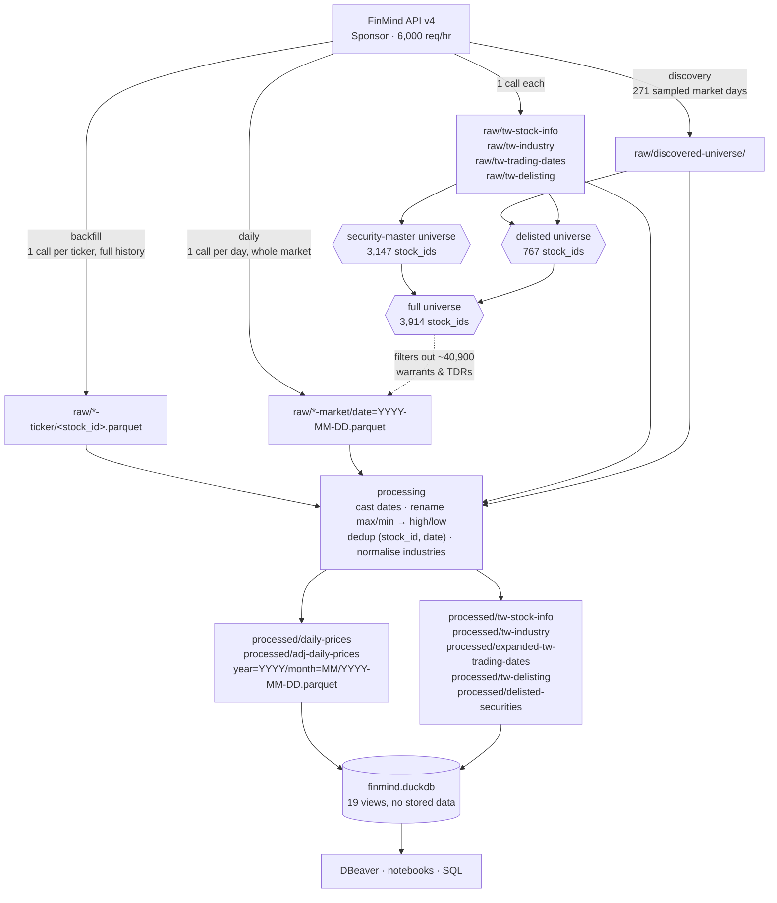
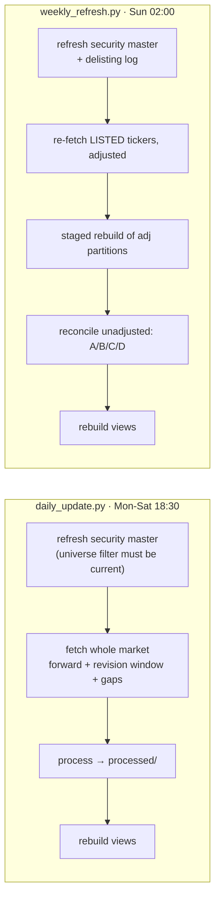

# Architecture

## Component roles

| Layer | Technology | Responsibility |
|---|---|---|
| Ingestion | Python + `requests` | Fetch from FinMind, land unmodified in `raw/` |
| Storage | Parquet + zstd | The single source of truth |
| Processing | Python + DuckDB | Type, rename, deduplicate, repartition into `processed/` |
| Query | DuckDB views | SQL access; the `.duckdb` file holds *only* views |
| Scheduling | Windows Task Scheduler | Daily incremental, weekly refresh |
| Exploration | DBeaver / Jupyter | Read-only connections to `finmind.duckdb` |

## Data flow



**Two universes, and they are not interchangeable.** The security master is
current-state: it lists what is listed *today*. The full universe adds the 767
securities that traded and then delisted, recovered by sampling whole-market
days. Anything that re-pulls a historical day filters on the full universe, or
the delisted securities are stripped out of that day; anything that asks
"should this ticker have fresh data?" uses the current master, or it re-fetches
frozen history every week for ever.

## Layer contract

**`raw/`** — exactly what the API returned. Dates stay as `YYYY-MM-DD` strings,
column names keep their upstream casing (`Trading_Volume`, `max`, `min`). Files
are only ever added or wholly replaced per ticker, never edited. Any processed
file can be regenerated from here.

**`processed/`** — the query contract. Real `DATE` columns, SQL-safe names,
deduplicated. This is what the DuckDB views read, and the only layer a query
should ever touch.

**`finmind.duckdb`** — views only, a few hundred KB. Delete it and run
`scripts/build_db.py` to get it back. This keeps Parquet authoritative and
sidesteps DuckDB's single-writer lock: scheduled jobs hold the file open only
long enough to redefine views.

## Why these shapes

**One Parquet file per trading day.** The daily job only ever *creates* a file,
so it is idempotent and an interrupted run cannot damage earlier days. And
because each file holds exactly one date, a trading day is either wholly present
or wholly absent — which is what lets reconciliation be a set comparison over
dates rather than a per-ticker audit.

One caveat, measured rather than assumed: a plain `WHERE date BETWEEN ...` does
**not** prune files. The Hive keys are `year` and `month`, and DuckDB cannot
infer them from a `date` predicate, so it opens all 8,053 footers (~0.56s for a
three-month range). Adding a `year BETWEEN ...` predicate prunes whole
directories instead (~0.13s, 4.3× faster). An arithmetic form such as
`(year*100 + month) BETWEEN ...` does *not* work — DuckDB will not push an
expression over partition columns down to the file lister.

The `daily_prices_between(lo, hi)` and `adj_daily_prices_between(lo, hi)` table
macros apply the rule for you:

```sql
SELECT * FROM daily_prices_between('2024-01-01', '2024-03-31')
WHERE stock_id = '2330';
```

**Two raw directories per price dataset.** The two fetch units have genuinely
different shapes and neither substitutes for the other:

- *ticker* — one call returns a ticker's entire history with no row cap
  (`2330` gives 8,053 rows back to 1994-10-01). The only affordable way to
  backfill, and the only way to refresh adjusted prices.
- *market* — one call returns every security for one day. The only affordable
  way to update daily. `end_date` is ignored when `data_id` is omitted, so this
  is strictly one day per call.

Keeping them apart means `raw/` stays append-only. Processing unions them and
resolves overlaps per dataset: for unadjusted prices the market pull wins (it
is the settled end-of-day snapshot); for adjusted prices the ticker file wins
(see below).

**Dimensions dedupe on a declared key, never on the whole row.** The price path
has always keyed on `(stock_id, date)` with a declared source priority; the
dimension transforms originally used `SELECT DISTINCT *`, which has no key at
all. That works only until a column moves on its own — and upstream re-stamps
most dimension rows with the crawl date on every pull, so a re-crawl of an
unchanged fact reads as a new fact. Measured on 2026-09-03, the second ingest of
each: `tw_industry` went from 6,871 facts to 11,520 rows, `tw_stock_info` from
4,321 to 7,633, both growing by roughly that much again per run. The keys now
live in `docs/data-lineage.md` and are asserted by `verify.py`.

**Adjusted prices are rebuilt, not appended.** Every dividend or split rewrites
the entire back-adjusted history for that ticker — `0050` opens at 4.43 in 2003
adjusted versus 37.09 unadjusted. Appending one day therefore leaves every
earlier row stale, so the weekly job re-fetches all tickers and rebuilds all
partitions through a staged directory swap.

**For the same reason the ticker file outranks the market-day file in the
adjusted series.** A market-day file holds that day on the basis in force when
it was pulled, and it is never re-pulled once it leaves the revision window.
Until 2026-10-04 the rebuild let it win, as it does for unadjusted prices, so
every weekly refresh fetched a correctly rebased history and then overwrote its
recent days with older snapshots. Found by cross-checking against TEJ: 6669
read 7,200 on 2026-08-28 against 2,413.84 in its own ticker file, a false -67%
break at its 2026-09-02 ex-right date; 1,046 rows across 319 securities were
affected. The days after the last ticker refresh are still market-sourced and
can sit on a newer basis than the history before them — that window is at most
a week, and `verify.py` warns when it grows.

## Scheduling



The daily job costs a handful of API calls and a few seconds. The weekly job
costs roughly 3,100 calls and about 40 minutes.

Both refresh the security master **first**, because it defines the universe
filter — a security listed today must already be known when its first bar
arrives.

The weekly job scopes its work to what is *currently* listed. A delisted
security has no further corporate actions, so its adjusted history is frozen
and re-fetching it is pure waste; FinMind serves no adjusted prices for
delisted codes anyway (7 of 767). The delisting log is re-ingested weekly for
one call, which is also what stops the reconciliation chasing the 251 codes
`TaiwanStockInfo` still lists years after they delisted.

`scripts/discover_delisted.py` is not scheduled. It recovers securities that
delisted before the first master snapshot, and that set is historical — it does
not grow. Delistings from here on are handled by the two jobs above.

## Self-healing

The daily job re-fetches three overlapping sets of days, which between them
cover every way data can go wrong:

- **forward** — every calendar day after the newest one already stored. A
  missed run simply catches up.
- **revision window** — the most recent few trading days, re-fetched and
  overwritten even though they are already present. FinMind revises same-day
  figures after the close: the 2026-08-20 bar for `0050` moved from 39,946,000
  to 43,382,378 shares once settled, prices unchanged.
- **gaps** — any calendar day missing from inside the observed range.

Days that have not been published yet return empty and are simply retried, so
they never look like gaps.
