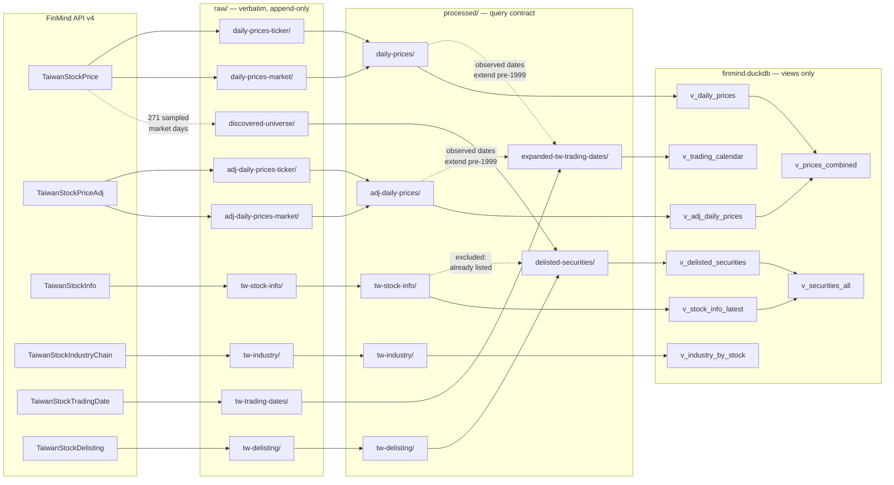
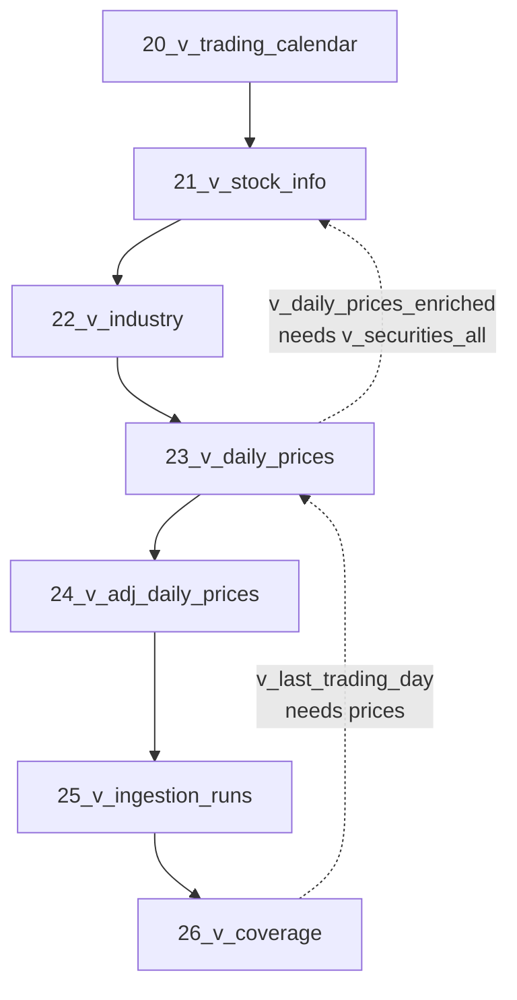

# Data lineage

Every processed file is reproducible from `raw/`, and `raw/` is reproducible
from the API. Nothing in the query layer stores data of its own.

## Dataset lineage

Note the dotted edges. The trading calendar depends on the price datasets. The
official calendar only reaches back to 1999-01-05, so the 1994–1998 segment is
derived from dates observed in the prices themselves. Processing order matters —
prices must be rebuilt before the calendar.

The delisted-securities table has the same property in reverse: membership is
everything the discovery sweep and the delisting log found *minus* whatever the
current security master already lists, so the master must be processed first.
`process_all_dimensions()` runs them in that order.

## Dependency order

`scripts/build_db.py` executes `sql/` in filename order, which encodes this:

`21_v_stock_info.sql` carries the whole security-master layer, delisted
securities included: `v_delisted_securities` and `v_securities_all` are defined
there rather than in a file of their own so that `23_v_daily_prices.sql` can
join `v_securities_all` without the numeric prefixes having to be renumbered.

## Transformations applied

| Step | Where | What |
|---|---|---|
| Universe filter | `ingestion/prices.py` | Drop ~40,900 warrants/TDRs from each market pull |
| Shape classification | `processing/universe.py` | Decide what a bare code is; only `common` and `etf` are in scope |
| Delisted membership | `processing/dimensions.py` | `(discovered ∪ delisting) − current master`, in-scope shapes only |
| Date cast | `processing/prices.py`, `dimensions.py` | `VARCHAR` → `DATE`; `"None"` → NULL |
| Column rename | `processing/prices.py` | `max`→`high`, `min`→`low`, `Trading_*`→`volume`/`turnover_value`/`transactions` |
| Width widening | `processing/schema.py` | Counts → `BIGINT` (`Trading_money` peaks at 5.3e10) |
| Deduplication (prices) | `processing/prices.py` | One row per `(stock_id, date)`; `market` beats `ticker` for unadjusted, `ticker` beats `market` for adjusted |
| Deduplication (dimensions) | `processing/dimensions.py` | One row per natural key, never per raw row — see below |
| Repartition | `processing/prices.py` | Per-ticker files → per-day files, chunked by year via DuckDB |
| Industry normalisation | `processing/dimensions.py` | `industry_category_norm` via `config/industry_alias.yml` |
| Index flagging | `processing/dimensions.py` | `is_index` from `Index` / `大盤` categories |
| Calendar expansion | `processing/dimensions.py` | Official ∪ observed price dates |
| Provenance stamp | `processing/prices.py` | `source` and `ingested_at` on every row |

### Dimension dedupe keys

Snapshots are unioned across every raw file, so each dimension needs an explicit
key. Upstream stamps most dimension rows with the *crawl* date and rewrites it on
every pull, so a whole-row `DISTINCT` would re-record the same fact on every run
— that is exactly what happened to both tables below on 2026-09-03.

| Table | Key | Date column keeps |
|---|---|---|
| `tw_stock_info` | content: `stock_id, stock_name, industry_category, industry_category_norm, type, is_index` | `min(snapshot_date)` — first seen |
| `tw_industry` | `stock_id, industry, sub_industry` | `max(snapshot_date)` — last seen |
| `tw_delisting` | `stock_id, stock_name, delisted_date` | `date` is a real event date, not a stamp |
| `expanded_tw_trading_dates` | `date` | — |

`min()` for the master because each of its rows is a historical fact and the
question is when it started being true; `max()` for industry because it has no
history to keep. Both are guarded by a `verify.py` check.

## Provenance in the data

Two columns carry lineage into the query layer:

- **`source`** — `market` or `ticker`, i.e. which fetch unit produced the row.
- **`ingested_at`** — when the processed partition was written. On
  `v_adj_daily_prices` this is how stale the adjustment basis is.

Run-level lineage lives in `db/finmind/logs/runs/*.jsonl` and is queryable as
`v_ingestion_runs`: which job ran, when, how long, what it produced, what
failed.

## Rebuilding

| Goal | Command | Re-fetches? |
|---|---|---|
| Views only | `scripts/build_db.py` | no |
| Processed from raw | `prices.rebuild_from_raw(...)` + `dimensions.process_all_dimensions()` | no |
| Adjusted prices from API | `scripts/weekly_refresh.py --skip-reconcile` | yes, ~3,100 calls |
| Delisted universe | `scripts/discover_delisted.py` | yes, 272 calls |
| Everything from API | delete `db/finmind/raw/`, then 維度 ingest → `discover_delisted.py` → `backfill.py` → `build_db.py` | yes, ~8,080 calls |

The first two are free and safe to run at any time.

`discover_delisted.py` **cannot be the first thing you run**: it calls
`load_calendar()` before it fetches anything, so on an empty warehouse it dies
with `FileNotFoundError`. Seed the calendar first — any run that ingests the
dimensions will do, e.g. `backfill.py --tickers 2330 --datasets daily_prices`.
`backfill.py` also does not rebuild the views, so finish with `build_db.py`.
