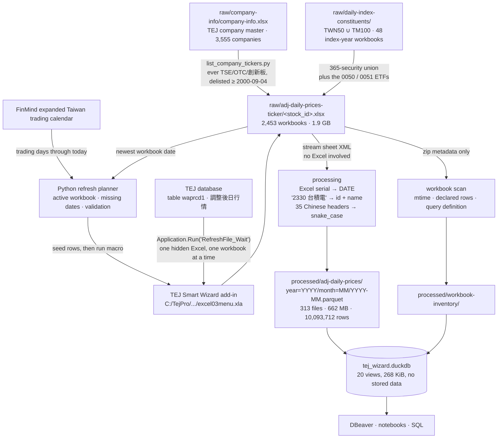
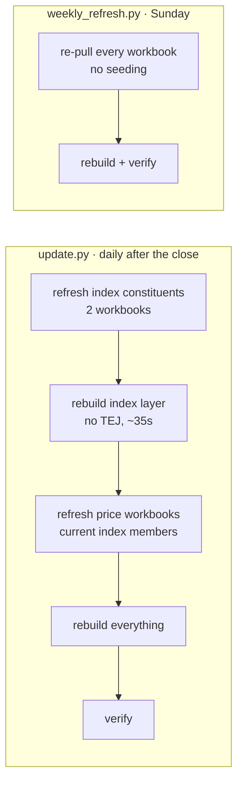

# Architecture

## Component roles

| Layer | Technology | Responsibility |
|---|---|---|
| Refresh | Excel COM + TEJ Smart Wizard add-in | Repopulate the xlsx workbooks in place |
| Storage | xlsx (raw) + Parquet/zstd (processed) | The workbooks are the source of truth |
| Processing | Python + pyarrow | Parse, type, split id/name, partition |
| Query | DuckDB views | SQL access; the `.duckdb` file holds *only* views |
| Scheduling | Windows Task Scheduler | One interactive daily job |
| Exploration | DBeaver / Jupyter | Read-only connections to `tej_wizard.duckdb` |

This mirrors the FinMind pipeline deliberately — same layer contract, same
Parquet-is-truth rule, same disposable view database — so that one mental model
covers both. Where it diverges, it diverges because the *source* is different,
not because the design drifted. Those divergences are the interesting part and
are called out below.

## Two datasets, one pipeline

Everything above applies twice, because there are two TEJ queries behind this
database:

| | `adj_daily_prices` | `index_constituents` |
|---|---|---|
| TEJ 表 | `waprcd1` 調整後日行情 | `widxs` 指數成分股 |
| Raw | `raw/adj-daily-prices-ticker/<stock_id>.xlsx` | `raw/daily-index-constituents/<INDEX>/<YYYY>.xlsx` |
| **Update unit** | one security's whole history | one index's whole year |
| Files | 2,453 | 48 (TWN50 25, TM100 23) |
| Rows | 10,093,712 | 834,748 |
| Key | `(stock_id, date)` | `(index_id, date, stock_id)` |
| Files that move daily | current index members (~150) | **two** — the current year of each index |

The second one is why the first one was built: `v_index_constituents` is the
point-in-time membership record that says which securities a historical index
cross-section should contain. Since 2026-09-28 the price universe is wider than
the indices — every company in `raw/company-info/company-info.xlsx` that ever
listed on TSE, OTC or 創新板 and was not delisted before 2000-09-04 — but the
daily job still refreshes only the index members. It also *leads* the price dataset by one session,
because TEJ publishes a constituent list for session D after D-1's close — see
[schema.md Part 2](schema.md#part-2--指數成分股-widxs).

Both share `xlsx_reader.iter_rows`, `parquet_io`, the staged-swap rebuild and
the DuckDB build. What is not shared is the schema module, the reader entry
point, the discovery rule and the key invariant — each contract owns its own,
because merging them would mean one module that is right about neither.

## Data flow



## Layer contract

**`raw/`** — the workbooks maintained through Excel and TEJ's add-in. Chinese
headers, Excel serial dates, `證券代碼` holding `"2330 台積電"` in one cell. The
pipeline never changes historical values by hand. Before refresh it may insert
only the calculated missing trading dates and the existing security identity;
TEJ then populates those rows, and the workbook is saved only after validation.

The raw layer also contains `daily-index-constituents/`, the 48 index-year
workbooks. Same rules, with one addition: only `<YYYY>.xlsx` is ingested.
A stray copy in those directories is data that already exists in a year file,
so ingesting it would duplicate every session it covers; the discovery rule
excludes it and logs that it did. The one that existed, `26-test.xlsx`, was
moved to `temp/test/` on 2026-09-05 — do experiments there, not in `raw/`.

The raw layer also contains
`daily-0050-constituents/0050_daily_constituents.feather`. It is the historical
selection provenance for the *original* 120 workbooks: its 119-security union
plus the 0050 ETF itself. That is no longer the shape of the price universe —
the 2026-09-05 expansion built the remaining index members from templates
(365 securities plus the 0050 and 0051 ETFs), and the 2026-09-28 expansion
added every eligible company in `raw/company-info/company-info.xlsx`, for 2,453
workbooks in all. company-info is likewise an externally supplied raw input
that no code here refreshes. **The Feather is
also no longer the membership authority** — `v_index_constituents` is, being
daily rather than a monthly snapshot expanded across days, official index
membership rather than ETF holdings, starting 2002-07-05 rather than 2003-06-30,
and current rather than stopping at 2026-07-31. The Feather is still the only
source of ISIN and of the ETF's own review snapshot weights. No code in this
pipeline creates or refreshes it; it is an externally supplied raw input, so its
own maximum date must be checked separately.

**`processed/`** — the query contract. Real `DATE`, SQL-safe names, id and name
split, one row per `(stock_id, date)`. This is what the DuckDB views read, and
the only layer a query should ever touch.

**`tej_wizard.duckdb`** — views only, 268 KiB. Delete it and run
`scripts/build_db.py` to get it back.

## Where this differs from the FinMind pipeline

**The raw layer is the source of truth, and it is not reproducible.** FinMind's
`raw/` can be regenerated at any time by replaying the API. These workbooks
cannot: TEJ is licensed, the query definition lives inside each file, and a
workbook damaged by an interrupted save is gone. That is why
`refresh_workbooks.py` copies every selected workbook aside before touching it, and why
it asks for confirmation instead of just running.

**The refresh unit is a security, while selection is incremental by missing
day.** One workbook is one security's entire history, so the TEJ operation and
backup unit remain the whole workbook. Before opening Excel, the daily job uses
the FinMind Taiwan trading calendar to find active workbooks that are missing
dates, inserts those dates below the header, and skips current or inactive
workbooks. `rebuild.py` still performs a full processed-layer rebuild behind a
staged directory swap. FinMind instead creates one new raw file per day and
never revisits older raw files.

**Partitions are monthly, not daily.** FinMind writes one Parquet file per
trading day because its daily job only ever *creates* a file — that makes the
append idempotent and means an interrupted run cannot damage earlier days. That
justification does not exist here, and the cost of copying the layout anyway is
large, because this dataset holds ~102 rows per trading day rather than ~1,800:

| grain | files | size | full scan | 3-month range | one ticker |
|---|---|---|---|---|---|
| day | 6,410 | 188.9 MB | 624 ms | 112 ms | 620 ms |
| **month** | **313** | **67.1 MB** | **41 ms** | **19 ms** | **40 ms** |

Measured 2026-09-03 on the 651,118 rows the dataset held before the
universe expansion. Monthly is 15× faster and 2.8×
smaller: per-day files of ~100 rows cannot compress, defeat dictionary
encoding, and each carries a footer describing 38 columns. The Hive keys stay
`year`/`month` either way, so the partition-pruning rule and the
`adj_daily_prices_between()` macro are unchanged. Flip `partition` in
`config/datasets.yml` to `day` and rebuild if you ever want the other shape.

**There is no rate limiter.** FinMind meters a 6,000/hr quota across processes.
TEJ's limit is enforced by the add-in's own session, so the pipeline's only
throttle is `addin.pause_seconds` between workbooks.

**Constituent exits are retained — and this is an advantage.** FinMind's
`v_adj_daily_prices` covers 7 of 767 delisted securities, because the upstream
adjusted endpoint returns nothing for delisted codes. Here 461 of the 2,453
securities have stopped trading (日月光 and 矽品 merged into ASE in 2018, 華映
delisted 2019, 晶電 merged into 富采 2021, 新光金 2025-07, 三商壽 2026-08) and
every one of them keeps its full adjusted history, because the workbook is
downloaded per security and TEJ serves the whole series. This avoids dropping
delisted companies. It does not make the 2,453 a point-in-time universe: an
index backtest must take membership from `v_index_constituents`, either by
joining on `(date, stock_id)` or through the `index_members_on(index_id, as_of)`
macro, and a market-wide one must use the securities that have a bar that day.
Companies delisted before 2000-09-04 are absent, so the earliest years still
carry some survivorship.

## Partition pruning

Same rule as the FinMind side, and it is not optional. The Hive keys are `year`
and `month`; DuckDB cannot infer either from a `date` predicate, so a plain
`WHERE date BETWEEN ...` opens every footer. Constrain `year`, or use the macro:

```sql
SELECT * FROM adj_daily_prices_between('2024-01-01', '2024-03-31')
WHERE stock_id = '2330';
```

Measured at month grain: 41 ms unpruned versus 19 ms pruned.

## The refresh mechanism

There is no HTTP API. The only thing that can repopulate a workbook is the TEJ
Smart Wizard add-in, and the add-in lives inside Excel. "Update without opening
Excel" therefore means Excel runs invisibly in its own process — nobody opens
anything by hand, but a hidden Excel is still doing the work.

What each workbook carries, and how the automation uses it:

- a defined name `XX_TEJ1` spanning `工作表1!$A$1:$AI$<n>`, which is how the
  add-in locates a refreshable block;
- an A1 cell comment holding the entire query — `tSearchString=2|||0|||waprcd1|||OPEN,HIGH,LOW,...|||DAY`
  names the TEJ table, the 33 field codes and the frequency. `schema.py`
  compares against this, so a workbook built from a different query is rejected
  rather than silently blended in;
- **no formulas at all.** Every cell is a static value, which is why the reader
  can stream the XML instead of going through Excel.

Six things the automation has to get right:

| Concern | Why | Handling |
|---|---|---|
| Don't disturb the user's Excel | Changing `EnableEvents` under a live session, or closing their workbooks | `DispatchEx` always starts a fresh process |
| The add-in is not loaded | COM-started Excel skips XLSTART and the `OPEN` registry add-ins | Open `excel03menu.xla` explicitly |
| The "auto refresh?" prompt | It comes from the add-in's VBA event sink; `DisplayAlerts = False` does not suppress a VBA `MsgBox` | `EnableEvents = False` while opening, then run the macro deliberately |
| A blocked macro | A synchronous COM call cannot be interrupted; an expired TEJ session raises a modal login | Watchdog thread terminates the Excel process on timeout |
| TEJ needs explicit target rows | Auto refresh does not invent a missing date row | Derive missing dates from the FinMind calendar, insert date and identity below the header, then validate before save |
| **Windows on screen** | `Application.Visible = False` is not enough: the add-in makes Excel visible during a refresh, and `TejRefresh.exe` opens its own progress dialog | Run the whole tree on a private Windows desktop |

The automation calls `RefreshFile_Wait`, exported by `Module1` of
`excel03menu.xla`. Unlike `RefreshFile`, which only launches `TEJRefresh.exe`
and returns asynchronously, the `_Wait` variant blocks until TEJ has finished
populating the active workbook. `RefreshWorkSheet` is the sheet-scoped
equivalent.

### The private desktop

Measured 2026-09-05 by enumerating the Default desktop during one refresh:
**four windows appear** — `TejRefresh.exe`'s WinForms progress dialog (twice,
480×128 dead centre) and Excel's `XLMAIN` — and they take focus. Over a
weekly job that now runs for most of a day (2,453 workbooks) that is the
difference between a background task and an unusable machine.

`DispatchEx` starts Excel on the *calling thread's* desktop and
`TejRefresh.exe` inherits Excel's, so binding the thread to a fresh desktop
before the Dispatch moves the whole tree. The same measurement with the switch
in place saw **nothing** on the user's desktop, and the refresh took 12.4s
against 13.0s — the isolation is free.

**The ordering is the whole trick.** `SetThreadDesktop` fails if the calling
thread already owns a window or hook, and `import pythoncom` creates one.
Measured: switching before the import succeeds; switching after it fails every
time, with `pythoncom` alone, with `win32com.client`, and after
`CoInitialize()`. So `ExcelSession.__enter__` switches first and refuses to
start if something imported COM before it.

### Seeding, and what "populated" means

One seeded row is `(identity, date)` in columns A and B. What comes back
differs by contract, which is why `SeedContract` exists:

| | proof of population | rows one seed yields |
|---|---|---|
| `waprcd1` | non-empty `close` (column F) | 1 |
| `widxs` | non-empty `成份股` (column C) | **the whole constituent set** |

The second was measured on 2026-09-05: one seeded row for 2026-09-07 in
`TM100/26-test.xlsx` became 100 rows (16,302 → 16,401) in 4.8s. So the index
workbooks are seeded one row per *session*, not one per constituent.

A settled date that TEJ does not populate aborts the save. A date past today is
seeded as **optional** — the index dataset's horizon is the next session, which
TEJ may not have published yet — and its prompt row is deleted before saving
rather than failing the run.

### Building a workbook that does not exist yet

The query definition lives in the A1 comment, so it cannot be composed from
outside the add-in. But it **does not name the security**: the identity is in
column A of every data row. So `create_workbooks.py` copies an existing
workbook, rewrites column A, clears `C:AI`, and refreshes.

Verified against a workbook downloaded by hand from the add-in: rebuilding 1103
from 1101's produced 6,411 rows over 2000-09-04..2026-09-04 and **230,796 of
230,796 cells identical**, with the same key set in both directions. TEJ also
resolves the bare id back to `1103 嘉泥` and trims the skeleton to the
security's real life — 7799, listed 2024-11-27, came back as 431 rows from a
6,410-date template with `XX_TEJ1` shrunk to match. So the caller does not need
to know a listing date, and one template serves every security.

Two things that bite: column A must be set to text format first or Excel writes
`0050` as the number `50`; and the build happens on a temporary path, moved
into `raw/` only after it validates, because a half-built workbook in the
source of truth is indistinguishable from a real one.

A third, found on 2026-09-28: a code TEJ has **no prices for** does not shrink
the skeleton. 5513, 8702, 8706 and 8709 (all delisted 2001–2003) came back as
the full 6,425-date template with the bare id in column A and every other field
empty, which passed the identity check. The build now also requires at least
one non-empty `close` before the move into `raw/`.

## Scheduling



**Why the index layer is rebuilt in the middle of the daily job**: stage 3 asks
the views which securities are in an index today. Without stage 2 it would be
asking about yesterday, so a security joining the index today would not have
its prices refreshed until tomorrow.

**Why there is a weekly job at all**: a back-adjusted history is not
append-only. Every ex-dividend rewrites the whole series, so a workbook whose
*dates* are complete can still hold a stale adjustment basis. The daily job
only touches current index members; a security that has left both indices stops
moving, which means `v_workbook_status` cannot detect its staleness — only
re-pulling can. The weekly job also re-pulls the index years without seeding,
because TEJ restates constituent weights after the fact and a seeded refresh
would only ever add new rows.

Since the 2026-09-28 company-info expansion this matters much more: of the
1,992 securities still trading, only the ~150 current index members move
daily. The other ~1,840 advance **only** in the weekly job, whose full re-pull
of 2,453 workbooks is estimated at ~8 hours. The schedule was deliberately left
unchanged for now, so those securities can be up to a week behind.

Both jobs stop at the first failing stage. If a refresh fails, the rebuild is
skipped **deliberately**: the workbooks still hold the previous run's data, and
rebuilding from them would reproduce the database that already exists while
making the run look successful.

A missed run needs no manual catch-up. The next run derives every missing
trading day from the FinMind calendar and seeds all of them. The one thing that
does need a human is the **first trading day of a new year**: the index
workbooks are one file per year and nothing creates next year's. The job fails
loudly rather than guessing which file to copy, because a workbook holding two
years is exactly what `assert_years_do_not_overlap` refuses to ingest.

The task must run **interactively** ("Run only when user is logged on"). A
Session 0 task cannot start Excel.

## Self-healing, and its limits

The rebuild is fully self-healing: it reads whatever is on disk and rewrites
every partition, so a corrupt or half-written processed layer is repaired by
running it again, for free.

The refresh is only partially self-healing. Seeded dates are validated for a
non-empty close before save; a failure leaves the original workbook untouched
and stops the update. `v_workbook_status` remains the independent post-rebuild
check: it compares each workbook's file modification time and newest bar, while
`rows_delta` catches a parse and a workbook disagreeing about row counts.
